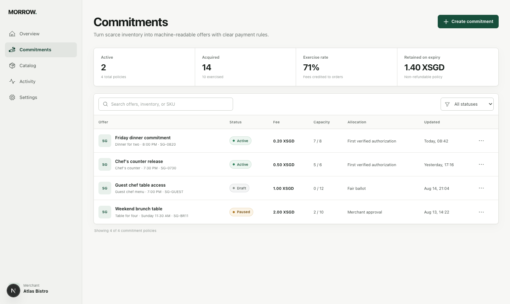

# Morrow

| | |
|---|---|
| Pitch video | [Google Drive](https://drive.google.com/file/d/1V4zbx8U207uxpn7otYMPjku4LEFuNFfJ/view?usp=sharing) |
| Repo | https://github.com/SaaiAravindhRaja/morrow-agent-commerce |
| App | https://morrow-agent-commerce.vercel.app/ |
| Architecture | https://morrow-agent-commerce.vercel.app/architecture |



Morrow is a merchant-side commerce primitive for scarce inventory. A merchant exposes a time-boxed, non-refundable commitment deposit that an agent can discover and acquire using x402 `exact` payment terms, authorized with Permit2. If exercised on time, the commitment is fully credited to the purchase.

Public demo: https://morrow-agent-commerce.vercel.app

For the idea, demo script, setup, and claim boundaries, start with [TEAMMATE_HANDOFF.md](TEAMMATE_HANDOFF.md).

The current demo uses a restaurant slot because it makes contention easy to understand. The same contract can represent appointments, tickets, rentals, and limited stock.

## What the preview proves

- a machine-readable merchant capability and commitment endpoint
- 0.20 XSGD represented as `200000` atomic units
- XSGD on Avalanche C-Chain mainnet (`eip155:43114`)
- x402 v2 `exact` authorized with Permit2. Mainnet XSGD also supports EIP-3009; Permit2 is a product choice, not a token limitation. `upto` cannot run on Avalanche with the stock SDK, and [/architecture](/architecture) shows the reproduction
- a two-agent inventory race with exactly one winner
- a zero-charge loser, because their authorization is never settled
- Anvil mainnet fork rehearsal (`rail/fork/`): real XSGD bytecode, Permit2 approve, `exact` proxy deployed

The public Vercel app includes a sample checkout that demonstrates the inventory and receipt lifecycle without charging a customer. Its `/api/commit` route publishes real x402 payment terms, while signed settlement is deliberately disabled in the hosted environment. The Anvil harness proves the settlement path separately against a local fork of Avalanche mainnet, and the checkout panel distinguishes a fork settlement from a simulated walkthrough.

Two Avalanche mainnet writes exist. The Permit2 approve, [`0xd29b48e9…dc6452`](https://snowtrace.io/tx/0xd29b48e98ccf45d4c5d61ac4d6eb85bd37418292496888395734b1c3a5dc6452), block 92847340, grants an allowance and moves no XSGD. The settlement, [`0xd365489a…47b7d2`](https://snowtrace.io/tx/0xd365489a08ff00f17c816e174cb8fd5d79c604a5db95159d1fd53244a047b7d2), block 92866192, moves 0.20 XSGD through the x402 exact Permit2 proxy to `0x22F2BD6f…fe54A`. The hosted checkout still does not broadcast. Do not claim an AWS deployment.

## Run locally

```bash
corepack pnpm install
corepack pnpm dev
```

Quality checks:

```bash
corepack pnpm test
corepack pnpm typecheck
corepack pnpm lint
corepack pnpm build
```

The default test tier is deterministic and does not require Anvil. Before a
build is considered deployment-ready, start the fork and run the integration tier:

```bash
cd rail/fork && ./start.sh && cd ../..
corepack pnpm test:fork
```

Live fork rehearsal (Foundry required):

```bash
cd rail/fork
./start.sh
./rehearse.sh
```

Set `MERCHANT_WALLET_ADDRESS` to a non-zero EVM address when you need `/api/commit` to emit payment terms. Live settlement on that route also needs the local fork and either `FORK_RPC` or `FACILITATOR_PRIVATE_KEY`. `/api/demo` tries `http://127.0.0.1:8545` and returns the sample result when the local fork is unavailable. The primary product route is [/](./); [/architecture](/architecture) contains the technical evidence and production mapping.

## Agent endpoints

- `/.well-known/agent-commerce`
- `/api/capabilities`
- `/api/commit`
- `/api/exercise`
- `/api/demo`
- `/architecture`

Buyer agent (needs `DEEPSEEK_API_KEY`, local server, and the fork):

```bash
corepack pnpm exec tsx agents/atlas.ts --budget=1.00
corepack pnpm exec tsx agents/atlas.ts --budget=0.05
```

The authoritative payment and claim decisions are documented in [docs/decisions/mainnet-mvp.md](docs/decisions/mainnet-mvp.md).
