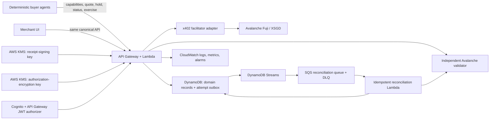
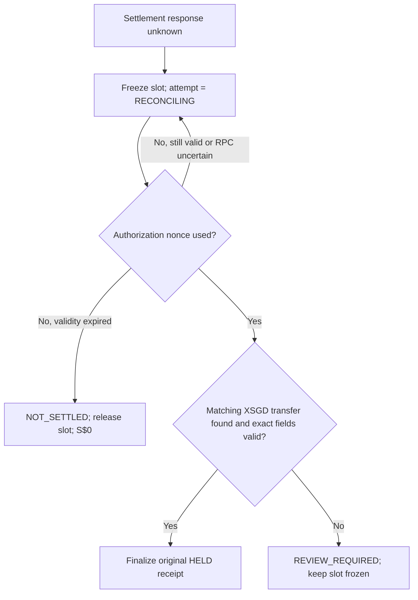

# Morrow - Implementation Plan

> **Superseded implementation plan.** This document preserves the original design exploration, including Fuji, S$5, option, signed-receipt, and AWS assumptions. Do not use those details as current build or judging claims. The current authority is [`docs/decisions/mainnet-mvp.md`](../decisions/mainnet-mvp.md) and the shipped product surface.

> **Working name only:** “Morrow” is a replaceable display brand. Domain names, APIs, and persistence keys must use product concepts such as `option`, `slot`, `quote`, and `receipt`, not the brand.

## Goal Capsule

- **Objective:** Build a merchant-side product that lets an AI agent buy a paid, expiring option on scarce inventory. Use a restaurant table as the memorable demo wedge, not as the product boundary.
- **Winning proof:** One buyer mandate fans out across four merchant fixtures. Two buyer agents then race for the same final slot. The merchant verifies both XSGD authorizations, atomically grants the inventory to one, settles only the winner through x402 on Avalanche Fuji, proves the loser paid S$0, and lets the winner exercise the option into a booking.
- **Track 3 authority:** The merchant creates a new machine-readable SKU, policy, API, receipt, and lifecycle for agents as first-class customers. Avalanche, x402, XSGD, and AWS enable that merchant product; they are not the product itself.
- **Prize targets:** Track 3 winner, Best Use of x402 on Avalanche, StraitsX Real-World Impact, and AWS Best Architected Solution.
- **Execution profile:** Deep implementation plan. Use test-first development for deterministic domain and payment-state behavior; use short live spikes before building around external payment assumptions.
- **Acceptance tier:** Tier A is a live merchant-owned x402 flow with exact XSGD on Fuji. Tier B is a separately labeled organizer card-MCP continuity path. Tier C is a separately labeled replay of previously captured proof. Neither fallback may borrow Tier A claims.
- **Stop conditions:** Do not settle real funds on mainnet; log or store replayable authorizations in plaintext; retain a losing authorization; retain the encrypted winning authorization after terminal resolution or its validity window; issue a new settlement while chain truth is unknown; or claim organizer/card payment as merchant-direct x402.
- **Landing:** Build and verify locally plus approved hackathon test infrastructure. Do not push, publish, or create production resources without the user’s explicit authorization.

---

## Product Contract

### Summary

Morrow lets a merchant quote, sell, and prove a paid temporary option on scarce inventory to an autonomous agent. The restaurant table is the demo: one verified XSGD commitment locks the final slot, while the losing agent is not charged.

### Problem Frame

Deposits and card holds already deter duplicate bookings, late cancellations, and no-shows. Programmatic agents make speculative fan-out far cheaper: one agent can reserve scarce alternatives across many merchants while intending to use only one. Merchants need an accountable, machine-readable price on temporary inventory before they need another generic agent checkout.

### Key Decisions

- **Sell temporary commitment, not a reservation marketplace.** Governs R1-R4 and R8. This proves a new merchant product without rebuilding discovery or booking infrastructure.
- **Price observable scarcity and duration only.** Governs R2 and R11. Agent identity must not create hidden discriminatory pricing.
- **Separate option exercise from later fulfilment.** Governs R3 and R8-R10. Exercise creates the durable booking and attaches the fee as credit; arrival or no-show occurs later.
- **Keep the buyer agent subordinate to the merchant surface.** Governs R7-R10. Track 3 must be obvious in every screenshot and pitch beat.
- **Treat direct merchant x402 settlement as the sponsor-grade tier.** Governs R4, R5, and R12. The organizer card MCP is continuity proof, not equivalent merchant-direct evidence.

### Actors

- A1. **Merchant operator:** Publishes eligible inventory, duration, fee formula, credit/forfeit terms, and risk caps; observes options and fulfils later bookings through authenticated actions.
- A2. **Buyer agent:** Requests options under a user-defined fee/hold-count mandate, accepts or rejects terms, receives the receipt, and exercises it before expiry.
- A3. **Payment facilitator and Avalanche:** Verify and settle signed XSGD authorization and expose transaction truth.
- A4. **Buyer/principal:** Authorizes booking intent and later arrives or no-shows. The MVP represents this mandate as a clearly labeled buyer-enforced demo artifact.

### Requirements

**Merchant product and policy**

- R1. The merchant can offer a paid, expiring hold on one specific inventory unit without creating a full marketplace.
- R2. The quote must show requested duration, remaining scarcity, exact XSGD fee, and a deterministic price explanation independent of agent identity.
- R3. Before payment authorization, the merchant must disclose that timely exercise creates a booking and attaches the fee as bill credit, while unexercised option expiry releases inventory and retains the fee; later booking no-show policy is a separate lifecycle.

**Payment and inventory integrity**

- R4. The agent must receive dynamic x402 terms for exact XSGD on Avalanche and settle with visible transaction proof; merchant-direct settlement is the sponsor-grade tier.
- R5. One logical hold must have one durable payment identifier so identical retries return the same outcome without a second charge.
- R6. Two agents contesting the same inventory must produce at most one paid hold; a losing contender must be rejected before its authorization settles.
- R7. An unknown settlement outcome must freeze the slot for reconciliation rather than resell it or attempt another charge.
- R7a. The request payer must equal the verified EIP-3009 authorizer, and the merchant must validate the confirmed transfer against every quoted payment field before issuing a receipt.

**Merchant experience and proof**

- R8. The merchant surface must distinguish inventory state (`AVAILABLE`, `PAYMENT_PENDING`, `HELD`, `BOOKED`) from receipt state (`HELD`, `EXERCISED`, `EXPIRED`); an expired receipt returns inventory to `AVAILABLE`.
- R9. A successful hold must produce a signed Commitment Receipt binding merchant promise, payer, buyer mandate hash, payment identifier, expiry, outcome policy, and Avalanche transaction.
- R10. The decisive demo frame must join one-agent/many-merchant fan-out, live inventory change, numeric countdown, XSGD proof, and independently evidenced loser non-settlement on one screen.
- R10a. The user mandate must visibly cap maximum fee and maximum active paid holds, and the agent must show an explicit accept/reject outcome for each quote.

**Scope and claims**

- R11. The product must state that ordinary card deposits remain simpler for a closed booking app and justify x402 only for interoperable machine customers.
- R12. The demo must accurately label simulated inventory/arrival data, recorded transaction fallback, organizer card issuance, and unverified mandate identity; it must not present the card-MCP path as merchant-direct x402 proof.
- R13. Capability discovery, policy read, quote, x402-protected hold, payer-authorized payment status, and payer-signed exercise are agent-accessible surfaces. Policy administration, inventory reset, reconciliation, option override, and fulfilment require authenticated, role-authorized merchant access.

### Key Flows

- F1. **Quote and hold:** The merchant prices an option, presents terms, verifies the agent authorization, atomically wins the slot, settles XSGD, independently validates the transfer, and issues one signed receipt. Covers R1-R10a.
- F2. **Contested inventory:** Two verified authorizations race for one slot. One conditional transaction wins; only that authorization is settled. The loser receives `SLOT UNAVAILABLE — S$0 CHARGED`. Covers R5-R7a and R10.
- F3. **Exercise or expire:** A payer-signed agent action before the deadline changes the slot to `BOOKED`, receipt to `EXERCISED`, and attaches the fee as credit. At or after the deadline, expiry wins, receipt becomes `EXPIRED`, and inventory returns to `AVAILABLE`. Covers R3 and R8-R10.
- F4. **Arrive or no-show later:** Authenticated merchant staff record later fulfilment against an exercised booking. This is controlled demo data, not part of the decisive payment proof. Covers R3 and R12-R13.
- F5. **Recover uncertain settlement:** The merchant freezes inventory while reconciliation determines whether the original EIP-3009 nonce was used and whether its transfer matches the quote. It never invents a new payment. Covers R5-R7 and R9.

### Acceptance Examples

- AE1. **Covers R2-R4.** Given the final Friday 20:00 table and a ten-minute request, when the merchant quotes S$5, the agent sees price reasoning, XSGD asset/network, credit rule, and expiry before signing.
- AE2. **Covers R5-R7.** Given two agents accept the same slot, when both submit valid authorizations, one settles and locks the table while the other receives an unavailable result with S$0 charged.
- AE3. **Covers R5, R7, R9.** Given settlement succeeds but the HTTP response is lost, retrying the same immutable payment identity returns the original receipt without another settlement.
- AE4. **Covers R3, R8-R10.** Given a held option is exercised before expiry, inventory becomes `BOOKED`, receipt becomes `EXERCISED`, S$5 credit is attached, and arrival remains later.
- AE5. **Covers R8, R10, R12.** Given live Fuji access fails during judging, recorded-proof mode labels the transaction as previously captured while live local contention and idempotency continue.
- AE6. **Covers R6-R7a, R10.** Given two valid authorizations race for one slot, evidence shows two payment IDs/nonces, exactly one used authorization and transfer, and an unchanged loser balance.
- AE7. **Covers R10a.** Given four S$5 quotes and a mandate permitting S$5 and one active hold, the agent accepts exactly one and visibly rejects the other three; an above-limit quote is rejected before authorization.

### Success Criteria

- A new judge understands within 20 seconds that the merchant sells temporary commitment, not restaurant discovery or generic payment infrastructure.
- The scripted 90-second path completes twice from a clean state with one real Fuji XSGD proof.
- Four labeled merchant fixtures show one mandate fanning out and visibly constrain the paid result.
- The two-agent race produces exactly one on-chain transfer and one option; the loser authorization remains unused and its balance delta is zero.
- Duplicate retry and lost-response recovery return the original receipt.
- The final screen makes merchant policy, inventory transformation, XSGD settlement, receipt, and loser proof readable without opening a block explorer.

### Scope Boundaries

**Deferred**

- Production POS/reservation integration, real AP2/Visa TAP mandates, refunds, non-XSGD PSP fallback, production multi-tenancy, general catalog discovery, and a UCP capability.

**Outside the product identity**

- Consumer chat, universal checkout, wallet policy, agent reputation, marketplace, new token, custom escrow contract, agent-identity price discrimination, and broad dispute infrastructure.

---

## Planning Contract

### Product Contract Preservation

- Requirements R1-R13, including R7a and R10a, flows F1-F5, and examples AE1-AE7 are preserved.
- Planning clarifies implementation identity, recovery, exercise authorization, and fallback claims without expanding the product scope.
- The restaurant demo remains the wedge; the underlying API and model use generic merchant inventory concepts.

### Assumptions

These defaults keep execution moving and may change only when new organizer or live-system evidence disproves them.

- “Morrow” is a placeholder display name stored in one UI configuration point.
- Four independently labeled merchants are seeded fixture namespaces behind one backend. This demonstrates a shared merchant contract, not production tenant isolation.
- The demo mandate is buyer-enforced and identity-unverified. Its visible decision log proves the simulator’s choices, not cross-merchant enforcement.
- The application’s signed Commitment Receipt is the authoritative domain receipt. The x402 signed offer/receipt extension may supplement it, but its standard fields do not bind all domain terms.
- 0xGasless is the first Fuji facilitator adapter because its current API exposes separate `/verify` and `/settle` operations for Fuji XSGD. The adapter remains replaceable.
- Fuji XSGD funding and any requirement to use the organizer card MCP are organizer gates. No public XSGD faucet is assumed.
- Testnet-only resources are acceptable. No mainnet or production card endpoint is used.
- AWS credentials may be unavailable locally. CDK synthesis and local tests are necessary; a deployed AWS test stack is required to claim the AWS prize implementation is live.

### Known Technical Decisions

1. **One TypeScript/pnpm workspace.** Use strict TypeScript across a Next.js merchant UI, deterministic agent simulator, Lambda API, shared domain package, and AWS CDK infrastructure. Avoid a polyglot build during the hackathon.
2. **One canonical backend.** UI and agents read/write the same Slot, Quote, PaymentAttempt, Receipt, Booking, and Audit records. The agent receives machine-readable capability, quote, hold, status, and exercise surfaces; it does not automate the web UI.
3. **Validate locally, decide inventory, then use the facilitator for the winner.** The API reconstructs the quote and verifies the x402/EIP-3009 payload in-process before the race. Only the conditional inventory winner is sent to the external facilitator for `/verify` and `/settle`. Unit 1 must prove the provider accepts this winner-only sequence; otherwise record the facilitator as a trusted authorization custodian before using the standard remote-verify flow.
4. **Full immutable retry identity.** Compare `merchant_id`, `payment_id`, `quote_id`, normalized `terms_hash`, `slot_id`, `slot_version`, verified authorizer, EIP-3009 nonce, and `authorization_hash`. `agent_request_id` is correlation only. A request-body payer is never authoritative.
5. **Transactional state plus durable outbox.** One DynamoDB `TransactWriteItems` call acquires the slot and records the payment-attempt transition. That attempt write is the durable DynamoDB Streams/outbox signal; an idempotent publisher sends delayed reconciliation through SQS FIFO with a DLQ.
6. **Independent settlement validation.** A facilitator success string or transaction hash is insufficient. Validate chain ID, token contract, authorizer, nonce, recipient, exact amount, and matching transfer/authorization usage before issuing the receipt.
7. **Unknown means frozen.** A timeout after settlement begins transitions the attempt to `RECONCILING`; it never releases inventory or submits another settlement until truth is resolved. Used-but-unmatched authorization becomes `REVIEW_REQUIRED` and stays frozen.
8. **Synchronous expiry is authoritative.** Reads and writes evaluate `expires_at` with server time. EventBridge Scheduler is eventual cleanup/notification only because its scheduling precision is 60 seconds.
9. **Payer-signed exercise.** Normal exercise is an agent action signed by the receipt payer and bound to receipt ID, booking terms, and deadline. Merchant override is separate, authenticated, and not implemented for MVP.
10. **Versioned application receipt signature.** Canonicalize the Commitment Receipt with RFC 8785 and sign the raw canonical bytes with an asymmetric KMS Ed25519 key using `ED25519_SHA_512`. Encode the signature as base64url and include `schemaVersion`, `kid`, and `alg`. Publish the KMS public key and receipt profile through merchant capabilities. The private key never leaves KMS; the fixture-to-key binding is explicitly demo trust, not production PKI.
11. **Deterministic evidence.** The simulator uses a barrier to release two paid requests concurrently. Each run uses a fresh `demo_run_id`, payment IDs, and nonces while retaining old audit evidence.
12. **Honest proof tiers.** Tier A, B, and C use distinct adapters, UI banners, receipt labels, and pitch language.
13. **Concrete merchant authentication.** Use a Cognito user pool with self-registration disabled and one admin-created demo operator. API Gateway JWT authorization plus a `merchant_operator` role claim protects every merchant-control route; local integration tests use signed fixture tokens and the UI labels this as demo authentication.
14. **Locked proof mode.** Health checks recommend a mode, the operator selects it before reset, and `proof_mode` is stored on the new demo run. Starting the run locks the mode; changing it requires another reset.

### Authoritative State Model

Inventory and receipt states remain intentionally small. Payment details use a separate durable attempt lifecycle.

| Object | State | Allowed next states | Key guard |
|---|---|---|---|
| Slot | `AVAILABLE` | `PAYMENT_PENDING` | Matching `slot_version`, unexpired quote |
| Slot | `PAYMENT_PENDING` | `HELD`, `AVAILABLE` | Same winning attempt only; `RECONCILING` or `REVIEW_REQUIRED` keeps the slot in `PAYMENT_PENDING`; release only after definite non-settlement |
| Slot | `HELD` | `BOOKED`, `AVAILABLE` | Payer-signed exercise before deadline, otherwise synchronous expiry |
| Receipt | `HELD` | `EXERCISED`, `EXPIRED` | One conditional transaction with slot and booking |
| Attempt | `QUOTED` | `VERIFIED`, terminal reject | Exact quote/payment/authorizer validation |
| Attempt | `VERIFIED` | `LOCK_ACQUIRED`, `SLOT_UNAVAILABLE` | Conditional slot transaction |
| Attempt | `LOCK_ACQUIRED` | `SETTLING` | Winner only |
| Attempt | `SETTLING` | `SETTLED`, `RECONCILING`, `NOT_SETTLED` | Persist known transaction data before response |
| Attempt | `RECONCILING` | `SETTLED`, `NOT_SETTLED`, `REVIEW_REQUIRED` | Independent chain truth |
| Attempt | `SETTLED` | `HELD` | Receipt and final state persisted or reconstructable atomically |

Terminal user-facing labels:

- `REJECTED BY USER MANDATE — NO AUTHORIZATION CREATED`
- `SLOT UNAVAILABLE — S$0 CHARGED`
- `PAYMENT NOT SETTLED — S$0 CHARGED`
- `RECONCILING — DO NOT RETRY OR RESELL`
- `PAYMENT REVIEW REQUIRED — SLOT FROZEN`
- `HELD — 5.000000 XSGD SETTLED`
- `BOOKED — S$5 CREDIT ATTACHED`
- `OPTION EXPIRED — S$5 FEE RETAINED; SLOT RELEASED`
- `PAYMENT ID CONFLICT — REQUEST REJECTED`

### Architecture



### Critical Payment Sequence

```mermaid
sequenceDiagram
    participant Agent
    participant API
    participant Facilitator
    participant DB as DynamoDB
    participant Fuji

    Agent->>API: request quote
    API-->>Agent: stored quote ID + terms hash + x402 requirements
    Agent->>API: paid request + signed authorization
    API->>API: reconstruct quote; locally verify x402/EIP-3009 payload
    API->>DB: conditional transaction: win slot + durable attempt
    alt lost inventory race
        DB-->>API: condition failed
        API-->>Agent: SLOT UNAVAILABLE — S$0 CHARGED
    else inventory won
        DB-->>API: LOCK_ACQUIRED
        API->>Facilitator: verify winning authorization
        Facilitator-->>API: verified authorizer and payment fields
        API->>Facilitator: settle winning authorization
        Facilitator->>Fuji: submit EIP-3009 transfer
        Facilitator-->>API: settlement response / tx hash
        API->>Fuji: independently validate nonce and exact transfer
        API->>DB: finalize HELD + signed receipt + audit
        API-->>Agent: receipt + PAYMENT-RESPONSE
    end
```

### Recovery Decision Flow



### Repository Shape

```text
apps/
  web/                         # merchant dashboard and decisive proof screen
  agent-sim/                   # deterministic buyer mandate and race runner
services/
  api/src/
    handlers/                  # capabilities, quote, hold, status, exercise, merchant actions
    domain/                    # orchestration and transition services
    adapters/                  # DynamoDB, x402, Avalanche, signing, clock
    reconciliation/            # stream/SQS consumers and recovery logic
packages/
  core/                        # canonical schemas, states, hashes, pricing, receipt model
infra/                         # AWS CDK stacks, alarms, queues, tables, API, secrets references
tests/e2e/                     # API/UI race, expiry, fallback, and recovery stories
scripts/                       # demo reset, live Fuji smoke, proof verification
docs/decisions/                # organizer gates and material substitutions
docs/evidence/                 # sanitized proof manifests; never secrets or raw authorizations
docs/runbooks/                 # setup, demo, recovery, fallback, teardown
```

Keep external systems as adapters inside the API until a real reuse boundary appears. Do not create a package for every integration.

### Data and API Contract

Minimum records:

- `MerchantFixture`: ID, display name, policy, proof-tier support.
- `Slot`: merchant/slot IDs, inventory attributes, version, state, winning attempt, timestamps.
- `Quote`: quote ID, slot/version, amount, duration, terms, normalized terms hash, server-authoritative payment requirements, and payment expiry. Quote authenticity comes from direct lookup of the immutable stored record and hash comparison, not a separate merchant signature.
- `PaymentAttempt`: immutable retry tuple; authorizer, nonce, authorization hash; state; facilitator result; transaction candidate; timestamps; failure reason.
- `Receipt`: canonical signed payload, payer, mandate hash, payment ID, option expiry, outcome policy, transaction proof, signature profile, and key ID. `expires_at` equals independently confirmed settlement time plus the quoted duration, including when delayed reconciliation finalizes the payment later.
- `Booking`: receipt ID, slot ID, attached credit, state, fulfilment fields.
- `AuditEvent`: demo run, actor, object, transition, reason, proof references.
- `Outbox signal`: a payment-attempt state/version change carried by DynamoDB Streams; every consumer re-reads authoritative attempt state.

Minimum public agent surface:

- `GET /.well-known/agent-commerce` — merchant capabilities, accepted network/asset, policy endpoint, proof tier.
- `GET /v1/merchants/:merchantId/policy`
- `POST /v1/quotes`
- `POST /v1/options/hold` — x402-protected paid action.
- `GET /v1/payments/:paymentId/status` — short-lived payer-signed request, or authenticated merchant access.
- `POST /v1/receipts/:receiptId/exercise` — payer-signed action.

Authenticated merchant surface:

- `GET /v1/merchant/dashboard`
- `POST /v1/merchant/demo-runs`
- `POST /v1/merchant/attempts/:attemptId/reconcile`
- Later fulfilment endpoints may exist only after the decisive flow is stable.

Every error is structured and includes stable code, safe user message, payment/attempt correlation, retryability, and current proof tier. Status and exercise signatures bind method, path, object ID, nonce, issued-at time, and environment audience to the stored payer. Do not return raw payment signatures or secrets.

Minimum DynamoDB access pattern:

| Access | Primary/index key | Notes |
|---|---|---|
| Slot atomic update | `PK=MERCHANT#<merchantId>`, `SK=SLOT#<slotId>` | Condition on state and version; one action per item per transaction |
| Durable payment identity | `PK=PAYMENT#<paymentId>`, `SK=PAYMENT` | Global logical uniqueness; immutable fingerprint stored here |
| Quote/receipt/booking lookup | `PK=<TYPE>#<id>`, `SK=<TYPE>` | Direct lookup, no table scan |
| Merchant dashboard | `GSI1PK=MERCHANT#<merchantId>`, `GSI1SK=<TYPE>#<time>#<id>` | Current inventory, attempts, receipts, bookings |
| Demo-run audit | `GSI2PK=RUN#<demoRunId>`, `GSI2SK=<time>#<eventId>` | Append-only evidence order |

The slot-acquisition transaction updates the slot once and conditionally creates the durable payment item with winning-attempt data. Audit can be embedded as the attempt’s first immutable transition for this transaction; later events are append-only items.

### External Gates and Flex Points

| Gate | Evidence required | If yes | If no / uncertain |
|---|---|---|---|
| G0 Track rule | Organizer confirms Track 3 scope and whether card issuance is mandatory | Keep merchant-direct Tier A | Preserve merchant product; demonstrate organizer MCP as separately labeled Tier B only if required |
| G1 Funding | Each possible winner has XSGD for every remaining funded smoke, two rehearsals, judging run, plus one-run buffer; wallets also have sufficient Fuji AVAX | Run live end-to-end | Build all deterministic logic; use honest Tier C only after capturing genuine proof |
| G2 Winner-only facilitator | Local validation rejects malformed payments; facilitator accepts `/verify` then `/settle` after the winner is chosen, without consuming nonce during verify | Keep losing authorization away from facilitator | If standard remote verify is required, record the facilitator trust assumption and prove the loser nonce remains unused; never weaken loser-S$0 evidence |
| G3 Recovery truth | Fuji contract/RPC exposes enough nonce and transaction truth | Automate reconciliation | Freeze unresolved attempts and require manual proof; do not auto-resettle |
| G4 AWS credentials | Test stack deploys and emits proof | Claim live AWS architecture | Show CDK synth/local tests and label AWS deployment incomplete |

### Flexible Delivery Gates

The clock decides depth, but not truth. Move to the next gate only when its acceptance proof exists.

1. **H0-H2: Kill assumptions early.** Confirm organizer rules, funded address, facilitator health, `/verify` then `/settle`, Fuji XSGD metadata, nonce truth, and no-approval EIP-3009 behavior. Record sanitized evidence.
2. **H2-H6: Build the invariant core.** Domain model, deterministic pricing, identity tuple, conditional race, duplicate retry, synchronous expiry, and in-memory/fake adapters.
3. **H6-H10: Complete the live vertical slice.** One merchant, one option, real Fuji settlement, independent validation, signed receipt, and status endpoint.
4. **H10-H14: Make the winning demo.** Four fixtures, buyer mandate, deterministic two-agent race, decisive one-screen merchant UI, and payer-signed exercise.
5. **H14-H18: Earn reliability proof.** DynamoDB transactions, outbox, reconciliation, DLQ, CloudWatch, CDK deployment, and one forced lost-response recovery.
6. **Final eight hours: Freeze product scope.** Rehearse twice from clean demo runs, capture Tier A evidence, verify fallbacks, improve pitch readability, and fix only demo-blocking defects.

If actual remaining time differs, preserve gate order and compress within gates. The live one-merchant vertical slice and decisive race take priority over breadth.

### Scope-Cut Order

Cut in this order if time is lost:

1. Later arrival/no-show UI and fulfilment.
2. Merchant manual reconciliation UI; keep script/API and audit proof.
3. EventBridge scheduled cleanup; keep synchronous expiry.
4. Polished multi-page dashboard; keep decisive single screen.
5. Full card-MCP UI; retain a documented, labeled adapter boundary.
6. Optional standard x402 signed-offer/receipt extension.

Never cut merchant ownership, exact XSGD on Avalanche, verify-before-lock-before-settle ordering, one-winner/loser-S$0 evidence, idempotent identity, unknown-state freeze, signed domain receipt, four-fixture mandate story, or honest proof-tier labels.

### Prize Proof Map

| Prize | Judge-visible proof | Implementation evidence |
|---|---|---|
| Track 3 | Merchant publishes a new machine-only paid option and converts it into booked inventory | Capability, quote, hold, receipt, exercise APIs and merchant dashboard |
| Best x402 on Avalanche | Dynamic 402 terms, separate verify/settle, exact Fuji XSGD, one race winner, loser authorization unused | Live tx, nonce states, balance delta, adapter transcript, receipt |
| StraitsX impact | XSGD prices real temporary commitment and reduces speculative scarce-inventory blocking | Transparent S$5 policy, credit/forfeit terms, real XSGD transfer |
| AWS architecture | Atomic state, durable outbox, idempotent at-least-once consumers, reconciliation, DLQ, observability | CDK stack, recovery test, CloudWatch dashboard/alarm, runbook |

### System-Wide Impact and Risks

- **Payment integrity:** The highest risk is a middleware or retry path settling the loser or charging twice. Control with explicit adapter calls, immutable identity comparison, and race/retry tests.
- **Data integrity:** DynamoDB has no SQL uniqueness constraint. Encode uniqueness in primary keys and condition expressions. The payment-attempt write inside the slot transaction is also the durable Streams/outbox signal.
- **Recovery:** Streams, Lambda, and SQS are at-least-once. Consumers must be idempotent, use aggregate versions, partial batch responses, bounded retries, and a DLQ.
- **Security/privacy:** Never log wallet keys, raw signed EIP-3009 authorizations, complete card data, or secret values. Persist only the winning authorization, encrypted with KMS envelope encryption and short retention, because crash recovery between lock and settlement needs the original authorization. For losers retain only payer, nonce, payment ID, and payload hash.
- **Authorization:** Public quote/hold/status endpoints validate schemas, terms, and payer binding. Merchant resets, reconciliation, overrides, and fulfilment require role authorization. Demo auth must be labeled as demo auth.
- **Clock correctness:** Inject a server clock into domain logic; never trust browser time. Define expiry equality as expired when `now >= expires_at`.
- **Provider dependence:** Keep facilitator and RPC behind interfaces. Health checks select proof tier, but never silently downgrade a claim.
- **Demo reproducibility:** A reset creates fresh IDs/nonces and fixture inventory without deleting prior evidence. Seed randomness and expose the run ID.
- **Cost:** Apply AWS budgets/short retention and provide a teardown command. Never run open-ended polling or high-frequency schedules.

---

## Implementation Units

### Unit 1 — Workspace, Configuration, and External Kill-Gate Harness

**Purpose:** Create a runnable skeleton and prove or reject external assumptions before feature work depends on them.

**Files**

- `package.json`, `pnpm-workspace.yaml`, `tsconfig.base.json`, `.gitignore`, `.env.example`
- `packages/core/src/config.ts`, `packages/core/src/config.test.ts`
- `scripts/live-fuji-smoke.ts`, `scripts/provider-health.ts`
- `docs/decisions/hackathon-gates.md`, `docs/evidence/README.md`

**Behavior**

- Pin Node and pnpm versions; add strict shared TypeScript configuration and workspace scripts.
- Validate required environment variables without ever printing values.
- Query Fuji chain ID 43113, CAIP-2 network `eip155:43113`, and XSGD contract metadata.
- Exercise provider health and prove the winner-only sequence: validate locally, acquire a provisional test lock, then call provider verify and settle with the smallest funded authorization available. Capture sanitized JSON evidence and whether the provider ever needs the losing raw authorization.
- Prove whether authorization use can be resolved by authorizer/nonce and how matching transfers are located.
- Record G0-G4 as `proven`, `failed`, or `unknown`, with timestamp/source and chosen proof tier.

**Tests and exit proof**

- Missing, malformed, or mainnet configuration fails closed.
- Evidence serializer redacts secrets/signatures.
- Tier A remains disabled until G1-G3 are proven, including the calculated per-wallet XSGD/AVAX run budget.
- `pnpm provider:health` and `pnpm fuji:smoke --verify-only` give deterministic exit codes.

### Unit 2 — Canonical Domain Model and Four Merchant Fixtures

**Purpose:** Lock the behavior that must remain correct regardless of provider or UI.

**Files**

- `packages/core/src/{schemas,states,pricing,terms-hash,payment-identity,receipt,clock}.ts`
- `packages/core/src/fixtures/merchants.ts`
- `packages/core/src/**/*.test.ts`

**Behavior**

- Define runtime-validated records and transition functions using x402 v2 wire/header conventions; assert `x402Version: 2`, `PAYMENT-SIGNATURE`, `PAYMENT-RESPONSE`, and `eip155:43113`, and do not copy v1 `X-PAYMENT` examples.
- Implement deterministic option pricing from duration and scarcity only.
- Canonicalize quote terms and full retry identity.
- Seed four labeled demo merchant fixtures, each with distinct policy/slot namespace but one contract shape.
- Represent buyer mandate cap and active-hold cap as buyer-side simulator policy; label it identity-unverified.
- Canonicalize and sign/verify the application Commitment Receipt payload.

**Tests and exit proof**

- Pricing is identity-independent and stable under field order.
- Terms or payment tuple mutation changes hashes and yields `PAYMENT_ID_CONFLICT`.
- All allowed and forbidden state transitions are table-tested.
- Expiry equality, duration boundaries, fee cap, and one-active-hold cap are explicit.
- Receipt signature breaks when merchant promise, payer, mandate hash, amount, expiry, or transaction changes.

### Unit 3 — Persistence, Merchant Contract, and Atomic Inventory

**Purpose:** Expose the Track 3 merchant surface and make inventory decisions durable.

**Files**

- `services/api/src/handlers/{capabilities,policy,quote,hold,status,exercise,merchant}.ts`
- `services/api/src/domain/{quote-service,hold-service,exercise-service}.ts`
- `services/api/src/adapters/{repository,dynamodb-repository,in-memory-repository}.ts`
- `services/api/src/**/*.test.ts`, `tests/integration/dynamodb/*.test.ts`

**Behavior**

- Implement capability/policy/quote/status endpoints first.
- Accept paid holds only when the client’s quote ID and terms hash match the immutable, unexpired server-stored quote.
- Use one DynamoDB transaction for conditional slot acquisition, the durable payment-attempt/outbox transition, and audit. Put the slot condition directly on its update; do not combine a condition check and update of the same item.
- Return the existing receipt/status for an identical retry; reject same payment ID with any identity mismatch.
- Enforce Cognito/API Gateway JWT authorization and the `merchant_operator` role on reset, reconciliation, override, and fulfilment actions; disable self-registration.
- Configure per-route API Gateway throttles and body-size limits. Reject malformed, expired, or quote-mismatched requests before RPC/facilitator calls, and cap concurrent pending attempts per payer and slot.
- Evaluate option expiry on every relevant read/write.

**Tests and exit proof**

- Concurrent fake-provider requests produce exactly one `LOCK_ACQUIRED` attempt.
- Same-ID concurrent identical retries converge; conflicting retries fail closed.
- Stale slot versions, expired quotes, wrong merchant, throttled abuse, and unauthorized merchant actions are rejected. Auth tests cover missing, expired, wrong-audience, and wrong-role tokens.
- Reset creates a new run and retains earlier audit/payment records.

### Unit 4 — x402, XSGD, and Independent Avalanche Validation

**Purpose:** Replace fake payment adapters with the live sponsor-grade vertical slice.

**Files**

- `services/api/src/adapters/{x402-facilitator,avalanche-validator,xsgd}.ts`
- `services/api/src/domain/payment-orchestrator.ts`
- `services/api/src/adapters/*.test.ts`, `tests/integration/payment/*.test.ts`
- `scripts/live-option-smoke.ts`, `scripts/verify-proof.ts`

**Behavior**

- Generate dynamic x402 v2 exact-payment requirements for CAIP-2 network `eip155:43113` and Fuji XSGD.
- Map canonical x402 domain types to the selected facilitator REST shape inside one contract-tested adapter; validate `/health`, `/list`, and `/tokens` in preflight, then enforce a pinned local allowlist during requests.
- Reconstruct payment requirements and locally validate EIP-712 domain, EIP-3009 signature, nonce, validity, balance, chain, asset, exact amount, and recipient before inventory acquisition. Never trust request-body payer.
- Send only the conditional inventory winner’s raw authorization to the external facilitator, call `/verify`, then call `/settle`. If G2 proves the provider requires remote pre-verification, document that trust boundary and retain independent loser-nonce proof.
- Persist attempt state around every side effect.
- Independently validate authorization use and exact XSGD transfer fields before receipt issuance.
- Treat every timeout, 5xx, malformed response, nonce-used response, or lost connection after `/settle` begins as `RECONCILING`, never definite failure or a blind new payment.

**Tests and exit proof**

- Wrong chain, asset, recipient, amount, payer, nonce, payment ID, quote, or terms hash fails before receipt.
- Local verification does not consume nonce; facilitator verification of the winner also leaves it unused until settle.
- Loser path sends no raw authorization to the facilitator and never calls settle in preferred Tier A mode.
- A live funded smoke produces exactly one validated transaction and signed receipt.
- Sanitized proof includes transaction, token, amount, recipient, authorizer, nonce state, run ID, and timestamp.

### Unit 5 — Deterministic Agent Simulator and Contested Race

**Purpose:** Turn the merchant API into the memorable winning story without an LLM in the critical path.

**Files**

- `apps/agent-sim/src/{client,mandate,quote-evaluator,wallet,race-runner,reporter}.ts`
- `apps/agent-sim/src/**/*.test.ts`
- `scripts/{demo-reset,demo-race}.ts`

**Behavior**

- Fan one buyer mandate across four merchant fixtures and display accept/reject reasons.
- Create no authorization for mandate-rejected quotes.
- Use two funded test agents and a deterministic barrier so both locally validated hold requests contend for the same slot.
- Poll status only with bounded retries and respect `RECONCILING`/`REVIEW_REQUIRED`.
- Produce a machine-readable proof manifest showing two payment IDs/nonces, winner transaction, loser unused authorization, and balance deltas.

**Tests and exit proof**

- A quote above fee cap and a second active hold are rejected before signing.
- Repeated seeded runs select the same quote and release the race at the same phase.
- Exactly one settlement adapter call occurs; loser balance delta is zero.
- Unknown outcomes stop safely and never create a new payment identity.

### Unit 6 — Merchant Proof Screen, Exercise, and Expiry

**Purpose:** Make the Track 3 product and the invariant understandable in one glance.

**Files**

- `apps/web/app/{page.tsx,api-client.ts}`
- `apps/web/components/{mandate-panel,merchant-grid,inventory-race,payment-proof,commitment-receipt,proof-tier-banner}.tsx`
- `apps/web/e2e/*.spec.ts`
- `services/api/src/domain/exercise-service.ts`

**Behavior**

- One decisive route shows: merchant policy/SKU, four quotes and mandate decisions, two-agent contention, live inventory state, option countdown, exact XSGD proof, signed receipt, and loser S$0 proof.
- Screen contract: a persistent run/proof-tier header; a dominant merchant inventory-and-race stage; a secondary horizontal mandate/quote strip; and a final winner-versus-loser proof area containing transaction, receipt, and booking transition. Avoid a grid of equal-weight dashboard cards.
- The buyer-agent simulator initiates exercise and obtains the fresh payer signature. The merchant proof screen is read-only for that action and reflects `exercise submitted`, signature rejected, expired during request, and `BOOKED` outcomes from the shared backend.
- The server decides exercise versus expiry atomically; `now >= expires_at` means expired.
- Every proof component has explicit states for no run, loading, race in progress, partial evidence, reconciling, review required, definite failure, validated success, exercised, and expired; no region silently stays blank.
- Tier A/B/C banners and proof fields are impossible to confuse. The pre-run mode gate shows health evidence, requires operator selection, records the tier on reset, and locks it when the run starts.
- Use semantic landmarks and controls, keyboard operation, visible focus, text-plus-color state distinctions, and restrained screen-reader announcements for meaningful transitions; the countdown must not announce every second.

**Tests and exit proof**

- Playwright covers happy path, loser, duplicate retry, expiry, exercise/expiry race, and each fallback banner.
- Exercise and expiry racing produce one terminal outcome and consistent slot/receipt/booking records.
- No proof card renders until required validation fields exist.
- At the venue display resolution recorded in `docs/decisions/hackathon-gates.md` (default QA: 1920×1080 at 100% zoom), the full proof reads without scrolling or a block explorer.
- Playwright/axe checks keyboard reachability, focus, accessible names, non-color-only states, and live-region behavior.

### Unit 7 — AWS Reliability, Reconciliation, and Observability

**Purpose:** Make failure recovery real and earn the architecture prize without bloating the product.

**Files**

- `infra/{app,api-stack,data-stack,observability-stack}.ts`
- `services/api/src/reconciliation/{stream-handler,queue-handler,reconcile-attempt}.ts`
- `services/api/src/reconciliation/*.test.ts`
- `docs/runbooks/{deploy,reconcile,teardown}.md`

**Behavior**

- Provision API Gateway HTTP API payload format 2.0, Lambda on Node.js 22, DynamoDB with point-in-time recovery where available, Streams, SQS FIFO/DLQ, CloudWatch metrics/alarms/dashboard, Cognito, an asymmetric receipt-signing KMS key, and a separate symmetric authorization-encryption KMS key through CDK. Use modular AWS SDK v3 only.
- Give only hold orchestration encrypt access and only settlement/reconciliation functions decrypt access. Bind ciphertext to payment, merchant, and demo-run IDs with KMS encryption context; set TTL to authorization expiry and delete ciphertext immediately after terminal resolution.
- Keep Lambda timeout below API Gateway’s 30-second integration ceiling and facilitator abort timeout shorter still; any post-submit timeout becomes status polling plus reconciliation.
- Use the payment-attempt change as the transactional outbox signal. The idempotent Streams consumer re-reads authoritative state and sends a delayed SQS FIFO reconciliation message grouped by payment ID; use partial batch responses and a DLQ.
- Reconcile `RECONCILING` attempts from authorizer/nonce/`AuthorizationUsed`/`Transfer` truth beginning at the stored pre-submit block. Bounded retries may resubmit only the same encrypted winning authorization while its nonce remains unused and valid; reconstruct the original receipt only from immutable stored data and validated chain fields.
- Escalate used-but-unmatched or exhausted attempts to `REVIEW_REQUIRED` and keep the slot frozen.
- Use EventBridge Scheduler only for eventual cleanup or notification, never exact expiry authority.

**Tests and exit proof**

- Duplicate stream/SQS delivery makes no duplicate transition or receipt.
- Forced failure before settlement, after broadcast, and after confirmation reaches the correct terminal state.
- KMS policy tests prove the public/read handlers cannot decrypt winning authorizations and ciphertext from one payment context cannot be decrypted under another.
- DLQ depth, reconciliation age, frozen-slot count, settlement failure, and receipt-signing failure are observable.
- `pnpm infra:synth` is clean; deployed test stack health and recovery proof are captured when credentials exist.

### Unit 8 — Fallbacks, Evidence, and Submission Freeze

**Purpose:** Make the demo survivable and every claim auditable.

**Activation:** Recorded Tier C and evidence hardening always apply. Implement the card-MCP adapter, Tier B behavior, and Tier B end-to-end test only if G0 confirms card issuance is required or the organizer explicitly values that path; otherwise retain only the documented adapter boundary and claim language.

**Files**

- `services/api/src/adapters/{card-mcp-fallback,recorded-proof}.ts`
- `docs/runbooks/{demo,fallback,submission}.md`
- `docs/evidence/proof-manifest.schema.json`
- `tests/e2e/{tier-a,tier-b,tier-c,rehearsal}.spec.ts`
- `README.md`

**Behavior**

- When activated by G0, Tier B records organizer MCP XSGD settlement and card issuance as its own action, then labels merchant-direct x402 as unproven.
- Tier C is selected before a demo run and replays a genuine prior transcript without pretending its transaction belongs to a new live run. Never switch an in-flight unknown live settlement into recorded mode.
- Health checks select or recommend a tier; operator chooses visibly. No silent downgrade.
- Add one-command reset, race, verification, and rehearsal flows.
- Document setup, architecture, exact claims, demo script, recovery, evidence, teardown, and known limitations.

**Tests and exit proof**

- Each proof tier renders only fields it actually proves.
- Recorded evidence validates against schema and cryptographic/domain hashes where possible.
- Two clean 90-second Tier A rehearsals succeed; Tier C rehearsal remains usable with network disabled.
- No secrets, raw authorizations, private keys, or full card data exist in logs, fixtures, screenshots, or committed evidence.

---

## Verification Contract

Commands are target scripts to implement in Unit 1 and keep stable:

```bash
pnpm lint
pnpm typecheck
pnpm test
pnpm test:integration
pnpm build
pnpm infra:synth
pnpm test:e2e
pnpm demo:reset
pnpm demo:race
pnpm demo:verify
```

Run live testnet commands only with funded hackathon wallets and redacted output:

```bash
pnpm provider:health
pnpm fuji:smoke --verify-only
pnpm demo:race --tier=a
```

Required verification stories:

1. Four quotes under one buyer-enforced mandate; rejected quotes create no authorization.
2. Two concurrent valid requests; exactly one settlement and one option.
3. Loser authorization unused and wallet balance delta exactly zero.
4. Identical retry before/after success converges to the same result; tuple conflict is rejected.
5. Lost response before broadcast releases only after definite non-settlement.
6. Lost response after broadcast freezes, reconciles chain truth, and returns original receipt.
7. Used nonce with mismatched/unlocatable transfer becomes `REVIEW_REQUIRED` and freezes inventory.
8. Exercise and expiry at the deadline produce one consistent terminal outcome.
9. Unauthorized merchant control is rejected.
10. Demo reset preserves prior audit evidence and never reuses payment IDs/nonces.
11. Tier B and Tier C cannot render Tier A claim text.
12. Two clean, timed 90-second rehearsals from fresh demo runs.

## Definition of Done

**Winner-grade exit**

- All R1-R13, including R7a and R10a, and AE1-AE7 are traceable to passing tests or explicit live proof.
- A judge can identify the merchant SKU, machine-readable policy, accepted quote, XSGD payment, inventory winner, loser S$0, signed receipt, and exercised booking from one screen.
- Tier A has a real Fuji XSGD transaction independently validated against every quoted field.
- Duplicate retries and uncertain settlement cannot cause a second charge or double-sell.
- Reconciliation survives at-least-once delivery and demonstrates one forced lost-response recovery.
- AWS CDK synthesizes; a live test stack is deployed and observed before claiming the AWS implementation is operational.
- All external proof is sanitized, reproducible, and tied to a unique demo run.
- Tier B/C modes are honest and rehearsed.
- Relevant unit, integration, build, infrastructure, and Playwright checks pass.
- Two consecutive clean 90-second demo runs pass before submission freeze.
- No secrets, plaintext or expired replayable authorizations, private keys, full card data, mainnet activity, or unsupported production claims remain. The short-lived encrypted winning authorization is deleted after terminal resolution or authorization expiry.
- Deferred code and dead scaffolding are removed; README and demo/recovery/teardown runbooks match reality.

**Submission-safe fallback exit**

- If an external gate makes Tier A impossible, the project may still be submitted only after deterministic merchant inventory, race, idempotency, receipt, exercise/expiry, and Tier B/C rehearsal tests pass.
- The submission and screen state exactly which live requirements remain unmet. In particular, R4, AE2/AE6 live-settlement proof, the x402 sponsor claim, and any undeployed AWS claim remain incomplete rather than being marked done.
- A fallback is a survival mode, not completion of the winner-grade goal. Continue pursuing Tier A while a safe funded path remains.

## Current Technical Facts to Recheck at Execution

Verified on 2026-08-14; refresh before coding against live services:

- Avalanche Fuji C-Chain uses chain ID `43113` and public RPC `https://api.avax-test.network/ext/bc/C/rpc`.
- The current 0xGasless Fuji XSGD configuration reports contract `0xd769410dc8772695a7f55a304d2125320a65c2a5`, 6 decimals, EIP-3009, and separate `/verify` and `/settle` endpoints. It is a rate-limited third-party dependency, so load tests use a fake adapter.
- Read-only Fuji calls returned XSGD name `XSGD`, decimals `6`, and an `authorizationState(address,bytes32)` function. A funded end-to-end recovery spike is still required.
- Current registry versions observed: `@x402/core`, `@x402/evm`, and `@x402/extensions` 2.22.0; `viem` 2.55.16; `next` 16.3.1; `aws-cdk-lib` 2.265.0. Pin compatible scoped x402 v2 packages only; do not start from the deprecated unscoped v1 package or old Avalanche v1 wire examples.
- EventBridge Scheduler has 60-second precision; exact option expiry must remain synchronous domain logic.
- DynamoDB Streams/Lambda and SQS are at-least-once delivery systems; handlers must be idempotent.
- The hackathon Dev Hub states there is no public XSGD testnet faucet and exposes StraitsX card-MCP sandbox/production endpoints. Use the sandbox only unless the organizers explicitly direct otherwise.

## Sources

- [AgentiX Playground Dev Hub](https://app.notion.com/p/convergencesummit/AgentiX-Playground-Dev-Hub-3b354aa8ea60806e80acd3c1a43b019f)
- [x402 facilitator flow](https://docs.x402.org/core-concepts/facilitator)
- [x402 extensions overview](https://docs.x402.org/extensions/overview)
- [x402 payment identifier](https://docs.x402.org/extensions/payment-identifier)
- [x402 signed offers and receipts](https://docs.x402.org/extensions/offer-receipt)
- [x402 v1-to-v2 migration](https://docs.x402.org/guides/migration-v1-to-v2)
- [0xGasless x402 facilitator API](https://docs.0xgasless.com/x402/facilitator-api/)
- [Avalanche x402 network setup](https://build.avax.network/academy/blockchain/x402-payment-infrastructure/04-x402-on-avalanche/02-network-setup)
- [StraitsX XSGD](https://www.straitsx.com/xsgd)
- [EIP-3009 transfer authorization](https://eips.ethereum.org/EIPS/eip-3009)
- [AWS EventBridge Scheduler precision](https://docs.aws.amazon.com/scheduler/latest/UserGuide/schedule-types.html)
- [DynamoDB condition expressions](https://docs.aws.amazon.com/amazondynamodb/latest/developerguide/Expressions.ConditionExpressions.html)
- [AWS transactional outbox pattern](https://docs.aws.amazon.com/prescriptive-guidance/latest/cloud-design-patterns/transactional-outbox.html)
- [DynamoDB Streams with Lambda best practices](https://docs.aws.amazon.com/amazondynamodb/latest/developerguide/Streams.Lambda.BestPracticesWithDynamoDB.html)
- [API Gateway HTTP API quotas](https://docs.aws.amazon.com/apigateway/latest/developerguide/http-api-quotas.html)
- [AWS KMS asymmetric key specifications](https://docs.aws.amazon.com/kms/latest/developerguide/symm-asymm-choose-key-spec.html)
- [AWS KMS Sign API](https://docs.aws.amazon.com/kms/latest/APIReference/API_Sign.html)
- [RFC 8785 JSON Canonicalization Scheme](https://www.rfc-editor.org/rfc/rfc8785.html)

## First Execution Move

Start Unit 1. Do not begin the dashboard or generic agent UX until the organizer rules, funded Fuji path, facilitator verify-before-settle behavior, and nonce-based recovery route are recorded in `docs/decisions/hackathon-gates.md`. Once those gates are known, build the one-merchant live vertical slice before adding four fixtures or visual polish.
