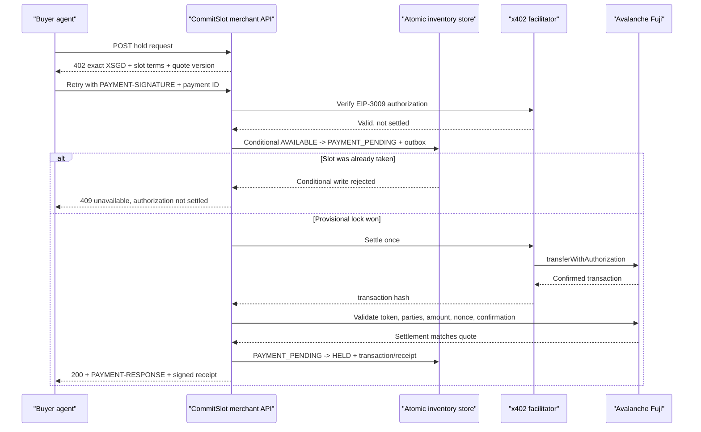
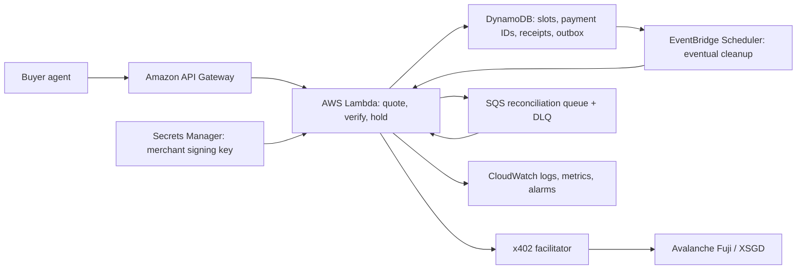

# CommitSlot

> Historical selection brief. Its original terminology and payment assumptions are superseded by [`docs/decisions/mainnet-mvp.md`](../decisions/mainnet-mvp.md). The current working name is Morrow.

> **Restaurants sell paid, expiring table holds that make autonomous agent bookings accountable.**

**Selection:** CommitSlot is the highest-win-probability Track 3 bet after a 60-concept search, hard gates, five-way scoring, standards/incumbent collision checks, and a three-finalist pre-mortem. It is not guaranteed to win. It is the strongest evidence-backed bet under the remaining hackathon time.

Last researched: 2026-08-14 20:39 SGT. Submission deadline: 2026-08-16 11:00 SGT, approximately 38 hours 21 minutes away at this draft.

## 1. The contrarian insight

The obvious Track 3 product makes stores easier for agents to buy from. CommitSlot starts from the opposite problem: **an agent can reserve ten scarce tables in milliseconds while intending to use only one.** The merchant needs a price on temporary commitment before it needs another checkout surface.

CommitSlot turns a short-lived inventory hold into a machine-only SKU. A restaurant publishes a live slot and its hold policy; an agent requests a four-seat, ten-minute option; the merchant replies with dynamic x402 terms; the agent commits XSGD on Avalanche; and the restaurant atomically locks the slot and returns a signed, countdown-based commitment receipt. Exercising the option before its deadline creates a durable reservation and attaches the fee as a bill credit; letting the option expire releases the table and retains the disclosed commitment fee. Arrival and no-show happen later in the reservation lifecycle and are not confused with option expiry.

This is narrower and more defensible than “Shopify for agents”: one painful merchant job, one new autonomous-customer failure mode, one visible settlement, and one unforgettable artifact.

## 2. Merchant beachhead and pain

### Beachhead

Fine-dining and high-demand restaurants in Singapore that already require reservation deposits, followed by reservation platforms serving those restaurants.

### Costly job

Protect a scarce table from speculative or duplicate reservations without forcing staff to call every guest, manually manage card holds, or leave inventory unavailable until a customer decides.

### Current workaround and evidence

- [Chope’s diner FAQ](https://www.chope.co/singapore-restaurants/pages/dinerfaq) says restaurants request deposits to discourage no-shows and late cancellations, and that deposit policies vary by time, occasion, group size, and restaurant.
- [Grab/Chope reservation terms](https://www.grab.com/sg/terms-policies/reservation-services-powered-by-chope/) allow forfeited deposits and future restrictions for no-shows, and require verifiable fulfilment evidence when attendance is disputed.
- [CNA’s Singapore reporting](https://www.channelnewsasia.com/singapore/restaurants-reservation-booking-fee-deposit-no-show-cancellation-2930231) quotes a restaurant operator who wanted to stop customers making multiple same-day restaurant bookings. One restaurant reported two-to-four no-shows weekly before introducing a S$25 card hold and one-to-two tables monthly after.

The current pain is verified. The claim that autonomous agents will multiply speculative fan-out is an inference: programmatic booking makes it cheap to hold alternatives concurrently. The MVP must show that new failure mode rather than pretend it is already measured.

### Why the merchant adopts

- It converts an all-or-nothing booking deposit into a configurable, very short commitment product.
- It compensates the merchant for temporarily removing scarce inventory from sale.
- It lets software customers transact without a bespoke platform account or a human phone call.
- It produces machine-verifiable evidence for option exercise, expiry, settlement, and dispute review.
- It can sit beside Chope, SevenRooms, or a restaurant’s own reservation system; it does not require a new consumer marketplace.

The dynamic fee must remain explainable and identity-blind. CommitSlot may price the last Friday-night table differently from an off-peak table or price a ten-minute hold above a two-minute hold; it must not quietly charge one agent more because of its identity, wallet, user, or inferred willingness to pay.

## 3. Product mechanism

### Merchant experience

The restaurant sees a live service map whose current inventory states are `AVAILABLE`, `PAYMENT_PENDING`, `HELD`, or `BOOKED`. Each Commitment Receipt separately retains its option lifecycle: `HELD`, `EXERCISED`, or `EXPIRED`. For the hackathon, a read-only, versioned policy card displays one published fixture rather than spending the build window on editor state. It shows:

- eligible slots and party sizes;
- minimum/maximum hold duration;
- base commitment fee plus a published slot-scarcity and requested-duration formula that never varies by agent identity;
- that exercise before the option deadline attaches the fee to the booking as a bill credit, while option expiry retains it;
- agent identity/mandate requirements;
- maximum simultaneous holds per payer or principal.

The demo policy is version `v1`; it prices only slot scarcity and requested duration. A future editor would publish a new version only for future quotes, while issued quotes, active holds, and receipts keep their signed policy version. Policy administration, fixture reset, option exercise, and later fulfilment actions require an authenticated merchant role; only quote and hold endpoints are public to agents.

### Agent-to-merchant flow

1. An agent discovers a restaurant slot through a tiny merchant API or MCP tool. It is the counterparty, not the product protagonist.
2. The agent calls `POST /v1/holds` with `slot_id`, `party_size`, requested TTL, payer address, an agent request ID, and a hash of the user’s booking mandate. The demo mandate visibly caps the fee at S$5 and simultaneous paid holds at one.
3. The merchant computes the economic cost of removing that slot from inventory. For the demo, the last Friday 20:00 table costs **S$5 for a ten-minute hold**.
4. The merchant returns HTTP `402 Payment Required` with exact XSGD/Fuji terms, expiry, a required payment identifier, and the signed hold terms.
5. The agent checks the quote against the user-defined fee and hold-count limits. It may explicitly reject the quote; for the decisive path it accepts, creates an EIP-3009 `TransferWithAuthorization` signature, and resends the same request with `PAYMENT-SIGNATURE` and the same payment ID.
6. The merchant verifies the signature without spending it, requires the request payer to equal the verified EIP-3009 `from` address, then atomically writes the provisional lock and recovery outbox: only `AVAILABLE` with the quoted inventory version can become `PAYMENT_PENDING`.
7. The merchant settles the authorization through the facilitator. It independently validates the confirmed Fuji transfer against the quoted chain, token, payer, recipient, amount, and nonce, then resolves that nonce through the stored quote/payment-ID mapping before changing the slot to `HELD`; a definite pre-transaction failure releases the provisional lock.
8. The server returns `200 OK` with `PAYMENT-RESPONSE` plus a signed **Commitment Receipt** binding restaurant, slot, party size, option deadline, policy version, fee/credit policy, verified payer, mandate hash, payment ID, nonce, and transaction hash.
9. Before the option deadline, the authorized agent exercises the receipt and creates a durable `BOOKED` reservation. The receipt becomes `EXERCISED` and the S$5 becomes a credit attached to that booking. If the agent does nothing, the receipt becomes `EXPIRED` and the table returns to `AVAILABLE`.
10. Restaurant staff later record arrival or no-show against the booking; arrival applies the attached credit to the bill. That fulfilment step is controlled demo data and is outside the 90-second payment proof. The demo does not claim escrow or an automatic legal remedy.

### The new machine-only product

Humans reserve a table. Agents buy a **temporary option on the restaurant’s inventory**. The option has an explicit price, duration, policy, and proof. That distinction is the product.

## 4. Why this is only possible now

- **Autonomous agents are load-bearing:** they can compare and act across many merchants faster than a human, creating the fan-out problem and needing a deterministic HTTP interface.
- **x402 is load-bearing:** the 402 is the merchant’s real-time economic counteroffer. Payment identifiers make retries safe; EIP-3009 gives a one-signature payment; verification before settlement enables atomic slot contention; the response carries settlement proof. Remove x402 and this becomes another closed reservation form with a card deposit.
- **XSGD is load-bearing:** the merchant prices commitment in the same SGD unit used for the table and receives a stable local-currency-denominated signal. Replacing it with a volatile asset makes the fee incoherent; replacing it with generic USDC weakens the Singapore merchant story.
- **Avalanche is load-bearing:** Fuji provides the visible, low-latency settlement proof for the demo; Avalanche mainnet has an official XSGD contract for a post-hackathon path. The on-chain transaction links the agent’s commitment to the inventory decision.

This does not mean blockchain is always superior. For a single closed booking app, a conventional card hold is simpler. The product earns its protocol complexity only when unknown agents need a common, retry-safe merchant endpoint.

### Falsification: why x402 instead of a card hold?

| Required property | Merchant-direct x402 | Tokenized card/closed PSP |
|---|---|---|
| Unknown-agent access | HTTP-native quote and payment without a merchant-specific agent account | Usually requires a card credential plus merchant/PSP integration |
| Decide inventory before money moves | Verify the signed authorization, win the conditional slot write, then settle | Authorization/capture can approximate this, but behavior is PSP-specific |
| Retry identity | Standard payment identifier plus EIP-3009 nonce | Provider-specific idempotency key |
| Public settlement proof | XSGD transfer and authorization state on Avalanche | PSP record visible only to integrated parties |

Cards can reproduce parts of the flow. The defensible claim is narrower: x402 supplies the open-agent negotiation, payment authorization, retry identity, and Avalanche proof in one HTTP-native path. If the merchant and every agent already share a PSP, the card path wins on simplicity.

## 5. The pitch and live demo

### Exact 30-second pitch

> AI agents will not only shop faster; they will hoard scarce inventory faster. One agent can tentatively reserve ten restaurants while its user chooses one, leaving nine merchants with dead tables. CommitSlot lets a restaurant sell a short, machine-priced option instead. The agent sees an x402 price, checks its user’s S$5 limit, commits XSGD on Avalanche, and the last table locks atomically. The merchant gets compensation and proof; exercising the option creates a booking with the fee attached as credit. We are not building another shopping agent. We are giving merchants a new product for autonomous customers: temporary commitment.

### Exact 90-second demo script

| Time | Screen and action | Spoken line |
|---:|---|---|
| 0-10s | A single booking mandate fans out across four restaurant cards. The baseline flashes `4 FREE TENTATIVE HOLDS / 1 DINNER INTENT`. | “One agent can freeze four restaurants while its user needs one table. That is the new merchant problem.” |
| 10-24s | Four CommitSlot 402 quotes appear, totaling S$20. The mandate badge says `MAX FEE S$5 / MAX ACTIVE HOLDS 1`; Agent A selects the last Friday 20:00 table and rejects the other three. | “A priced option makes fan-out visible and costly. The user, not the model, sets the maximum fee and hold count.” |
| 24-40s | Agent A signs; show `5.000000 XSGD`, Fuji, EIP-3009, payment ID, and the settlement. | “One signature commits XSGD on Avalanche. The 402 is the merchant’s real-time economic counteroffer.” |
| 40-54s | Agent B contests the same slot. The atomic write rejects it before settlement. A proof strip shows both payment IDs/nonces, `settlements 1/2`, and Agent B balance delta `S$0`. | “Only one verified commitment can settle. We prove the loser’s authorization stayed unused and its balance did not move.” |
| 54-68s | Slot changes to `HELD`; a 20-second option countdown starts beside the signed Commitment Receipt. | “The merchant now has a paid, expiring option instead of silent inventory hoarding.” |
| 68-74s | Agent A clicks `Exercise` before zero. Inventory becomes `BOOKED`; receipt becomes `EXERCISED`; `S$5 CREDIT ATTACHED` appears. | “Exercise converts the short option into a real booking. Arrival happens later; we do not fake that distinction.” |
| 74-90s | Expand the receipt and proof chain: policy version, mandate limit, payer, payment ID, nonce, Fuji transaction, and loser no-charge invariant. | “CommitSlot joins authority, payment, and inventory in one proof. Agents become first-class customers when merchants can price commitment, not just checkout.” |

### The remembered frame

One full-screen **Commitment Receipt** over a live restaurant floor map:

- left: one mandate’s four-option fan-out collapses to one allowed paid hold, then the last table flips `AVAILABLE -> PAYMENT_PENDING -> HELD -> BOOKED`;
- center: a large numeric countdown and “S$5 XSGD option; exercise to attach booking credit”;
- right: a vertical proof chain, `agent mandate -> 402 terms -> XSGD settled -> slot locked`, ending in the Snowtrace transaction link;
- footer: Agent B’s simultaneous attempt, visibly `AUTHORIZATION UNUSED — BALANCE DELTA S$0`, backed by both nonces and the one-settlement invariant.

The visual is a product surface, not a block explorer screenshot with a dashboard beside it. The judging target is a 1440x900 presentation viewport; narrow-screen optimization is deferred. Status always uses persistent text and an icon in addition to color, the countdown always has numeric text, and the single action is keyboard reachable with visible focus.

## 6. Prize-fit matrix

Prize stacking is unverified, so this is an eligibility and demo-proof matrix, not a winnings claim.

| Prize | Why it fits | Proof judges see |
|---|---|---|
| **Track 3: AI-native Commerce** | A merchant creates a machine-only SKU and policy for autonomous customers; the shopper agent is only the counterparty. | Restaurant policy card, fan-out cost, contested-slot decision, inventory state, and commitment receipt. |
| **StraitsX Real-World Impact** | Locally evidenced restaurant no-shows and duplicate bookings; SGD-denominated commitment maps naturally to XSGD. | S$5 XSGD hold tied to a real Singapore deposit workflow and credited/forfeited outcome. |
| **Avalanche Best Use of x402** | The 402 is a dynamic option quote; verify-before-settle and payment ID protect scarce inventory; settlement produces the state change. | Real Fuji EIP-3009 XSGD transaction plus the losing contender rejected without charge. |
| **AWS Best Architected** | Atomic writes, idempotent recovery, expiry, least privilege, observability, and failure queues are essential to avoid “paid but no table” failures. | Kill a post-settlement callback during the demo or test panel, then show reconciliation recovering the same hold without double charge. |

## 7. Concrete x402 and XSGD design

### Protected resource

`POST /v1/holds`

Logical request body:

```json
{
  "slot_id": "table-7:2026-08-15T20:00+08:00",
  "party_size": 4,
  "requested_ttl_seconds": 600,
  "agent_request_id": "agt_01K...",
  "payer": "0xAgentWallet",
  "mandate_hash": "0xsha256..."
}
```

### 402 terms

- scheme: `exact`;
- network: `eip155:43113` / Avalanche Fuji;
- asset: test XSGD `0xd769410dc8772695a7f55a304d2125320a65c2a5`;
- amount: `5000000` atomic units for S$5 in the decisive demo;
- recipient: team-controlled merchant test wallet;
- authorization window shorter than the inventory quote;
- payment identifier: required and persisted at logical-request scope;
- signed terms: hash of slot version, party size, TTL, fee outcome, quote expiry, and merchant key ID.

For the hackathon, call the last item application metadata or a CommitSlot extension draft; do not falsely claim it is a ratified x402 extension. The MVP can use the official payment-identifier extension and sign the receipt at the application layer.

### Payment and state choreography



### Idempotency and recovery

- Generate one payment ID per logical hold, never per network retry.
- A unique constraint on `(merchant_id, payment_id)` returns the existing response for duplicate requests.
- A unique EIP-3009 nonce prevents the same authorization from settling twice.
- Derive receipt ownership and per-payer limits from the verified EIP-3009 `from` address; reject any request-body payer mismatch before taking inventory.
- The slot transition uses a versioned conditional write; only one contender reaches settlement.
- Store the provisional lock and outbox record before settlement. If settlement succeeds but the response is lost, the reconciler searches by payment ID/transaction and finalizes the same hold.
- Do not issue a receipt from a facilitator hash alone. Validate the confirmed Fuji settlement fields, then resolve its nonce through the stored logical payment-ID/quote mapping.
- If verification or settlement fails before a transaction exists, release `PAYMENT_PENDING` and never mint a receipt.
- If settlement truth is temporarily unknown, keep `PAYMENT_PENDING`, show “reconciling,” and do not re-settle or sell the slot until the worker resolves it.

## 8. XSGD feasibility verdict

**Verdict: protocol-compatible and independently supported by a live XSGD facilitator on Avalanche. A live hackathon proof is conditionally feasible, not cleared, until the organizers confirm merchant-direct x402 permission and provide usable Fuji XSGD.**

Verified on 2026-08-14:

- [StraitsX](https://www.straitsx.com/xsgd) lists the Avalanche mainnet XSGD contract as `0xb2F85b7AB3c2b6f62DF06dE6aE7D09c010a5096E`. A read-only `decimals()` call to Avalanche C-Chain returned 6; [Snowtrace](https://snowtrace.io/token/0xb2F85b7AB3c2b6f62DF06dE6aE7D09c010a5096E/contract/code?chainId=43114) shows the verified proxy and six decimals.
- The [0xGasless facilitator documentation](https://docs.0xgasless.com/x402/facilitator-api/) and live `/health` plus `/tokens` responses list XSGD on mainnet and Fuji. Fuji uses `0xd769410dc8772695a7f55a304d2125320a65c2a5`, six decimals, EIP-3009 settlement, no prior approval, and the EIP-712 domain `{name: "XSGD", version: "2"}`. The public facilitator was live and healthy; `/settle` returns a transaction hash and the facilitator pays gas.
- Read-only inspection of the organizer’s StraitsX card MCP confirms a separate fallback: its sandbox issues a test Visa card after an x402/EIP-3009 payment in testnet XSGD on Fuji and returns `settlement_tx`.

Remaining blocker: the Dev Hub says there is no public XSGD testnet faucet. The team must obtain Fuji XSGD from the organizers or their API environment before the live proof.

### Honest fallback ladder

1. **Acceptance Tier A — preferred and required for the clean Avalanche/x402 claim:** a merchant-owned x402 hold endpoint settles test XSGD directly through the currently healthy public facilitator. This tier is gated on organizer permission and funded Fuji XSGD.
2. **Acceptance Tier B — continuity fallback, not equivalent proof:** the supplied card MCP performs x402/XSGD settlement for disposable-card issuance, and that test card enters the merchant hold flow. This preserves a real organizer-approved XSGD lifecycle, but it does **not** prove that the merchant’s dynamic hold endpoint itself is x402-protected and therefore weakens the Avalanche sponsor case.
3. **Acceptance Tier C — resilience only:** replay a previously completed test transaction and signed receipt while the live system runs inventory contention, exercise, expiry, and idempotency against a deterministic fixture. Never present a recorded or mocked transaction as live.

## 9. Minimal AWS architecture



Only the API path, state store, and logs are necessary for the first thin slice. Every hold read or write evaluates the authoritative `expires_at` timestamp synchronously, so the 20-second demo countdown cannot depend on EventBridge’s minute-level scheduling precision. EventBridge performs only eventual cleanup. Queue/DLQ and managed secret handling earn their place because “settled but response lost” and privileged receipt signing are core failure modes, not sponsor decoration.

### Six Well-Architected pillars

| Pillar | Concrete design decision |
|---|---|
| Operational excellence | Structured state-transition logs, correlation by payment ID, dashboards for stuck `PAYMENT_PENDING`, a one-command fixture reset, and a written recovery runbook. |
| Security | Non-custodial payer wallet; merchant receives funds but never the payer key; least-privilege IAM; signing key in Secrets Manager; validated timestamps/nonces; request-size/rate limits; no raw card storage in the fallback. |
| Reliability | DynamoDB conditional writes, unique payment IDs, outbox/reconciliation queue, DLQ, bounded retry with jitter, explicit unknown-settlement state, and deterministic receipt replay. |
| Performance efficiency | Lambda and DynamoDB on-demand for bursty agent traffic; one indexed slot lookup; no model call on the payment path; verify/settle time measured separately. |
| Cost optimization | Serverless pay-per-use, log retention limits, alarms/budgets, and no always-on cluster; demo load has a hard concurrency cap. |
| Sustainability | Scale-to-zero managed compute, short data retention for request payloads, and no redundant model inference; retain only hashes and audit-critical fields. |

### Threat and failure paths

| Threat/failure | Control and visible outcome |
|---|---|
| Replay or duplicate retry | EIP-3009 nonce plus required payment ID; return cached receipt. |
| Two agents race for one slot | Versioned conditional write before settlement; loser is not charged. |
| Spoofed payer or cap bypass | Request payer must equal verified authorization signer; derive ownership and limits from the signer. |
| Facilitator returns wrong proof | Independently validate the confirmed Fuji transfer against every quoted payment field before issuing a receipt. |
| Payment settles, response is lost | Outbox/reconciler finalizes the same receipt; client retries with same payment ID. |
| Slot locks, settlement fails | Release provisional lock; no receipt; bounded retry only when settlement truth is known. |
| Facilitator/RPC unavailable | Circuit-break new holds, preserve existing state, show degraded status, use recorded proof for pitch only. |
| Forged merchant terms | Merchant signs normalized terms; receipt includes terms hash/key ID. |
| Agent hides principal or mass-books | Per-payer caps in MVP; optional UCP/AP2/Visa TAP mandate/identity signals later. Do not claim full identity assurance. |
| Hidden price discrimination | Display the deterministic scarcity/duration formula and exclude agent identity, wallet history, and inferred willingness to pay from pricing. |
| Secret leakage | No payer secret exists server-side; merchant signing material comes from Secrets Manager with rotation and minimal IAM. |

### Failure-state UX contract

| Condition | Agent/merchant message | Safe action |
|---|---|---|
| Stale quote | `QUOTE EXPIRED — S$0 CHARGED` | Requote |
| Lost slot contention | `SLOT UNAVAILABLE — S$0 CHARGED` | Choose another slot |
| Definite pre-transaction failure | `PAYMENT NOT SETTLED — S$0 CHARGED` | Retry with the same logical request |
| Settlement unknown | `RECONCILING — DO NOT RETRY OR RESELL` | Refresh status only |
| Duplicate retry after success | Existing signed receipt | No new settlement |
| Facilitator outage | `NEW HOLDS PAUSED` | Keep existing holds visible; use recorded proof only for the pitch |

## 10. Standards and incumbent collision

| Standard/product | What it already solves | Gap CommitSlot owns |
|---|---|---|
| [UCP](https://ucp.dev/documentation/core-concepts/) | Business capability discovery, checkout, order lifecycle, payment handlers, AP2 mandates, and vendor extensions. | No standard machine-priced temporary restaurant-inventory option. CommitSlot could later be a vendor capability, not a competing universal protocol. |
| [ACP](https://www.agenticcommerce.dev/) | Programmatic agent-to-seller checkout while the seller stays merchant of record. | Checkout begins after intent; CommitSlot prices the merchant’s cost of temporary intent before the full order. |
| [AP2 through UCP](https://ucp.dev/documentation/ucp-and-ap2/) | Signed user intent and payment authorization tied to checkout state. | Proves authority, but does not compensate the restaurant for an expiring pre-checkout hold. |
| [Visa Trusted Agent Protocol](https://developer.visa.com/capabilities/trusted-agent-protocol/trusted-agent-protocol-specifications/) | Signed HTTP recognition, payer/consumer signals, timestamps, and replay-resistant nonces for agents initially unknown to merchants. | Identifies or authenticates an agent; it does not create the scarce-inventory commitment product. It is complementary. |
| Chope/Grab, OpenTable, SevenRooms, [Oddle Reserve](https://www.oddle.me/sg/products/restaurant-reservation-system) | Reservations, deposits/prepayments, card guarantees, cancellation rules, table maps, reminders, and restaurant operations. Oddle says it serves 5,000+ restaurant partners. | Existing systems already solve substantial human reservation operations. CommitSlot’s narrower gap is a permissionless, dynamically priced, seconds-to-minutes option invoked by any compatible agent, with payment and inventory race proof. |
| [x402 signed offers/receipts and payment ID](https://docs.x402.org/extensions/payment-identifier) | Payment negotiation and safe retry primitives. | CommitSlot composes them into an atomic merchant inventory decision and a domain-specific receipt; it does not claim to invent the primitives. |
| [x402-signals](https://github.com/x402-foundation/x402/issues/2291) | Independent post-settlement fulfilment/refund/status patterns. | CommitSlot focuses on pre-settlement scarcity contention and temporary inventory; status/refund ideas are deliberately excluded from the MVP. |
| Crossmint agent wallets/cards/checkouts | Buyer-agent wallet, card, x402 payment, and browser checkout infrastructure. | Those are purchase rails. CommitSlot is the merchant’s policy/product for autonomous reservation pressure. |

### Differentiation test shown in the demo

One booking mandate first fans out across four restaurants; four priced quotes expose S$20 of potential commitment, and the user’s S$5/one-hold limit collapses the fan-out to one accepted option. A second agent then contests that last table: the winner settles and receives the option, while the loser’s authorization remains unused and its balance does not move. A normal storefront, agent wallet, standards bridge, or x402 paywall does not produce that merchant inventory decision and its negative-payment proof.

## 11. Smallest buildable MVP

### Must work

- one restaurant and three real-looking table/time slots;
- read-only published policy card for fee, TTL, exercise/credit rule, mandate limit, and per-payer cap;
- `POST /v1/holds` with dynamic 402 response;
- one real Fuji XSGD payment and transaction link;
- required payment ID and idempotent retry;
- atomic contention between two agents;
- inventory `AVAILABLE -> PAYMENT_PENDING -> HELD -> BOOKED` plus separate receipt `HELD -> EXERCISED/EXPIRED`; expiry returns inventory to `AVAILABLE`;
- full-screen Commitment Receipt and a simple failure/recovery panel;
- fan-out baseline plus one user-defined maximum fee/active-hold mandate;
- race evidence showing two payment IDs/nonces, one settlement, unused loser authorization, and unchanged loser balance;
- deterministic recorded-proof mode.

### Ruthless non-goals

- no consumer restaurant discovery app;
- no production POS, Chope, Grab, OpenTable, or SevenRooms integration;
- no new token, NFT, smart contract, escrow, DAO, marketplace, reputation network, or price-prediction model;
- no KYC/compliance claims, chargebacks, automated legal disputes, tax logic, or production refunds;
- no multi-restaurant catalog or real reservation scraping;
- no generic UCP/ACP implementation;
- no production card handling or storage.

### Honest mock boundaries

- Restaurant floor plan, availability, dynamic fee rule, option exercise, later arrival, and bill credit are controlled demo data.
- XSGD transaction, payer, amount, and hash must be real Fuji proof in the preferred demo.
- If the card fallback is used, the card is test-only and its PAN must never be logged or shown in the recording.
- “Agent mandate” is a demo hash unless a real AP2/TAP credential is integrated; label it accordingly.

### Required credentials and data

- funded test EVM wallet with Fuji XSGD;
- merchant recipient wallet;
- public facilitator access or organizer MCP access;
- AWS account/credits and least-privilege deploy credentials;
- no StraitsX production or mainnet credentials required;
- three demo slots and one pricing policy fixture.

## 12. Team split

### One builder

Build the vertical slice in order: state machine/API, x402 payment, single-page merchant visual, recorded fallback, then AWS deployment. Skip agent natural language; use a scripted client.

### Two builders

- Builder A: x402/XSGD client-server handshake, wallets, facilitator, idempotency, settlement recovery.
- Builder B: merchant floor map, read-only policy card, commitment receipt, demo choreography, pitch assets.
- Pair on atomic contention, AWS deployment, and final rehearsals.

### Three builders

- Builder A: protocol/payment integration and fallback.
- Builder B: backend state machine, DynamoDB conditional writes, expiry, reconciliation, observability.
- Builder C: merchant interface, agent simulator, visual proof, pitch/video/submission.
- Everyone stops feature work for integration and demo rehearsal at the same milestone.

## 13. Deadline-aware build order

### H0-H2: kill the external-risk questions first

- Obtain Fuji XSGD and complete one minimal XSGD settlement to the merchant wallet.
- Confirm direct merchant x402 endpoints are permitted; ask prize-stacking and demo-format questions.
- Save a transaction hash and sanitized fixture immediately.

- Deliver the 30-second premise and contested-table storyboard to one restaurant operator and one organizer or judge proxy. Continue only if both can explain how a paid short option differs from an ordinary booking deposit; switch to FitProof if the product distinction itself fails this test.

**Payment contingency:** if Tier A cannot work by H2, preserve CommitSlot and switch to the clearly labeled Tier B card-MCP or Tier C recorded-proof path. Do not burn the build window switching concepts for a rail failure that would also affect the fallback ideas. Switch concepts only when the product premise or organizer interpretation invalidates CommitSlot.

### H2-H6: decisive backend slice

- Implement slot/receipt state machines, quote hash, payment ID, conditional write, and scripted fan-out plus contention clients.
- Prove that Agent B loses before settlement.

### H6-H10: remembered visual

- Build floor map, 402 sheet, proof chain, countdown, and receipt.
- Use a compressed 20-second option deadline in demo mode; production policy displays ten minutes. Evaluate expiry synchronously on every read/write; the scheduler is cleanup only.

### H10-H12: formal 12-hour kill switch

Run the full 90-second demo twice on a clean machine. The critical success path is: fan-out visible, user limit enforced, real proof, atomic lock, loser non-settlement independently evidenced, option exercised into a booking, receipt. Cut every feature that does not improve that path.

### H12-H18: failure and AWS credibility

- Add idempotent retry, lost-response reconciliation, one DLQ scenario, structured metrics, least-privilege secret handling, and recorded-proof mode.

### H18-H24: pitch and submission skeleton

- Record a fallback demo while the system is healthy.
- Finish architecture graphic, README, judging matrix, evidence links, and exact claims.

### H24-H30: polish and adversarial QA

- Test weak Wi-Fi, delayed facilitator, duplicate click, stale quote, simultaneous agents, expiry, and cached replay.
- Rehearse with one presenter and one silent recovery operator.

### Final reserve

Freeze features with at least eight hours left. Reserve the final block for submission upload, video backup, pitch timing, and sleep. Do not depend on mainnet, production card issuance, or a live restaurant.

## 14. Security and trust model

- **Non-custody:** the agent signs in its wallet; CommitSlot never receives its key. The facilitator submits only the signed authorization.
- **Authorization:** amount, recipient, token, validity window, and unique nonce are bound in the EIP-3009 signature. The request payer must equal the verified authorizer; limits and receipt ownership use that verified address. The application additionally binds slot terms through a signed receipt/terms hash.
- **Double-charge/replay prevention:** one logical payment ID, unique database key, cached result, one EIP-3009 nonce, and settle-once state transition.
- **Double-book prevention:** conditional inventory version before settlement; provisional state blocks concurrent contenders.
- **Merchant control plane:** policy administration, inventory reset, exercise, and fulfilment are authenticated and role-authorized; quote/hold remains the only public agent surface.
- **Keys and secrets:** payer keys stay client-side; merchant receipt signing key is managed and least-privileged; no keys in repository or logs. Historical receipt verification needs a published key ID/rotation policy after the hackathon.
- **Settlement trust:** a facilitator response is insufficient by itself; the merchant validates the confirmed on-chain transfer against the quote before moving to `HELD` or signing a receipt.
- **Refund/failure:** MVP fees attach as credit when the option is exercised and are retained on disclosed option expiry; refunds are not automatic. Unknown settlement state freezes the slot for reconciliation. Production would need merchant terms, later no-show/refund operations, and legal review.
- **Auditability and privacy:** immutable transaction hash plus append-only application state events; logs contain hashes/IDs, not private card or personal data. Do not place restaurant, slot, party size, or mandate data on-chain; production needs authenticated receipt retrieval, redaction, retention, and deletion rules.
- **Claims we must not make:** guaranteed elimination of no-shows, legal escrow, MAS approval of CommitSlot, production readiness, verified human principal, universal agent compatibility, automatic refunds, or prize stacking.

## 15. Post-hackathon path and design partners

### Deployment path

1. Pilot as an API beside one restaurant’s reservation system, with only last-table/high-demand windows enabled.
2. Measure hold conversion, no-show rate, revenue recovered, booking abandonment, and false blocking versus static deposits. Agree falsification thresholds with the design partner before making an adoption claim.
3. Add a UCP vendor capability for discoverable `temporary_inventory_option` rather than inventing a universal commerce standard.
4. Integrate AP2/Visa TAP signals for principal/agent policy and a PSP/card fallback for agents without XSGD.
5. Offer the policy/receipt layer to a reservation platform; keep settlement handlers modular.

### First five realistic conversations

These are outreach targets, not claimed partners or endorsements:

1. **Chope/Grab reservations:** local platform with documented deposits, no-show rules, fulfilment disputes, and merchant reach.
2. **[Oddle Reserve](https://www.oddle.me/sg/products/restaurant-reservation-system):** Singapore restaurant-technology operator already offering reservation deposits, card guarantees, no-show protection, and live table views; it can evaluate whether the short agent-only option is incremental rather than duplicative.
3. **SevenRooms Singapore/APAC:** reservation/guest-experience incumbent whose policy engine could host agent-only holds.
4. **The il Lido Group:** the group is cited in local reporting discussing card holds and duplicate same-day bookings.
5. **Un Yang Kor Dai:** the cited local restaurant reportedly used a S$25 hold and measured a material no-show reduction.

### Why Singapore FinTech Festival viewers care

The demo makes agentic payments legible to a non-crypto operator: local-currency stablecoin becomes a business rule that protects a table, not a speculative asset. It also exposes the hard production question SFF audiences care about: how payment, machine intent, and real-world fulfilment remain consistent under races and failures.

## 16. Top five risks and mitigation

| Risk | Severity | Mitigation |
|---|---|---|
| Judges say “ordinary reservation deposit with crypto.” | Existential | Show one mandate fan out across four merchants before showing the priced cap, two-agent contention, open HTTP path, and machine-verifiable option receipt. Run the operator/judge-proxy premise gate before building. |
| No Fuji XSGD or merchant-direct permission is available. | Existential for the sponsor claim | Ask organizers immediately and settle/record proof first. Label card MCP as a weaker continuity tier, not equivalent merchant-direct proof; never substitute USDC silently. |
| Payment succeeds but slot state fails. | High | Verify, provisional atomic lock, settle, outbox, reconciling state, and cached receipt. Show this recovery as AWS proof. |
| Restaurant willingness to accept dynamic holds is untested. | High | Frame the MVP as a policy experiment for high-demand windows; measure conversion/no-show outcomes; do not claim adoption. |
| Scope expands into a reservation platform or standards project. | High | One restaurant, three slots, scripted agent, no discovery/POS integration, one application-layer receipt schema. |

## 17. Organizer questions still capable of changing the build

1. Can Track 3 and multiple sponsor prizes stack?
2. What are the rubric, demo duration, and submission artifacts?
3. How does the team receive Fuji XSGD when no public faucet exists?
4. May a Track 3 merchant endpoint use the public XSGD-capable facilitator, or must x402 occur through the supplied card MCP?
5. Is `settlement_tx`/Snowtrace proof sufficient, and is a live transaction mandatory?
6. Which credentials, AWS credits, and allowlists will be issued?
7. Is disposable-card issuance mandatory for Track 3?
8. Which Track 3 examples/anti-examples did judges already present?

The short ask-ready version is in [organizer-questions.md](./organizer-questions.md).

## 18. Fallback concepts

### Fallback 1: FitProof

Industrial spare-parts merchants sell a paid, signed compatibility guarantee to purchasing agents, reducing wrong-part returns. Switch if restaurant-reservation feedback rejects the problem or if judges have already shown paid reservation concepts. It still needs a credible parts dataset and merchant cost evidence.

### Fallback 2: PromiseRoute

Same-day merchants sell a signed delivery SLA and issue an XSGD credit when the promise fails. Switch only if organizers explicitly prefer post-purchase fulfilment and accept an implementation closely adjacent to `x402-signals`; otherwise the incumbent collision is too strong.

## 19. Why the obvious ideas lost

1. **Shopping comparison agent:** Track 1, not merchant-native.
2. **Agent wallet/spend controls:** Track 2 and heavily saturated by Crossmint and recent hackathon winners.
3. **Agent-ready storefront/merchant MCP:** UCP, ACP, Crossmint, and ordinary merchant APIs already cover most of the story.
4. **x402 paywall/payment button:** technically valid but has no novel merchant outcome.
5. **Universal checkout wrapper:** crowded, integration-heavy, and indistinguishable in 90 seconds.
6. **Generic escrow/refund layer:** infrastructure drift plus direct collision with recent x402 escrow and `x402-signals` work.
7. **Merchant analytics dashboard:** x402 remains decorative and the screenshot has no transformation.
8. **Dynamic pricing engine:** pricing alone is not a new agent-native product and requires data the team does not have.
9. **Agent reputation/fraud score:** crowded, hard to prove with fake history, and mostly Track 2 trust infrastructure.
10. **Loyalty token:** token mechanics do not solve the selected merchant pain.
11. **Paid product-data crawl:** generic API paywall and an emerging commercial-content pattern.
12. **Surplus-food marketplace:** strong local impact, but requires real supply/demand and collides with incumbent marketplaces.
13. **Post-payment audit trail:** current x402 accountability proposals already occupy the gap.
14. **Delivery SLA refund:** strong runner-up, but `x402-signals` already specifies much of the protocol surface.

## 20. Decision log

| Time (SGT) | Decision | Reason |
|---|---|---|
| 2026-08-14 20:11 | Treat organizer MCP as a fallback, not the whole idea. | Its x402/XSGD card-issuance flow is a supplied primitive everyone can copy; Track 3 needs a merchant-native outcome. |
| 2026-08-14 20:14 | Kill generic post-settlement promise/refund protocol. | `x402-signals` v0.2 and accountability proposals create direct incumbent collision. |
| 2026-08-14 20:16 | Promote paid temporary inventory over ordinary booking. | It turns agent fan-out into a new merchant SKU and produces a clear contested-resource demo. |
| 2026-08-14 20:18 | Allow direct XSGD merchant settlement as technically viable. | The live public facilitator reports Fuji/mainnet XSGD, six decimals, EIP-3009, no approval, healthy status, and transaction-returning settlement. |
| 2026-08-14 20:20 | Select CommitSlot over FitProof and PromiseRoute. | Best local pain evidence, strongest 90-second visual, smallest real-data dependency, and greatest distance from current protocol work. |
| 2026-08-14 20:27 | Make pricing deterministic and identity-blind; elevate unknown settlement to a first-class state. | The requirements pass exposed fairness risk and the dangerous “paid but table resold” ambiguity. |
| 2026-08-14 20:35 | Separate option exercise from diner arrival and separate receipt state from inventory state. | A ten-minute option must become a durable booking before it expires; arrival happens later. The original wording could release a valid booking or credit the wrong event. |
| 2026-08-14 20:36 | Rebuild the 90-second demo around both fan-out and contention. | The original two-agent race proved concurrency but not the one-agent/many-merchants failure mode that makes the idea novel. |
| 2026-08-14 20:37 | Make merchant-direct x402 a gated acceptance tier; downgrade card MCP to continuity only. | Card issuance uses x402/XSGD but does not prove the merchant’s dynamic 402 hold endpoint and therefore cannot carry the same sponsor claim. |
| 2026-08-14 20:38 | Add synchronous expiry, negative-payment evidence, verified-payer binding, on-chain settlement validation, and merchant-role authorization. | The review found a minute-granularity scheduler mismatch, an interface-only loser claim, and three avoidable trust-boundary gaps. |
| 2026-08-14 20:39 | Replace the demo policy editor with a published read-only fixture and keep CommitSlot through rail failure. | This protects the decisive experience and avoids wasting the build window on configuration state or an unnecessary concept reset. |

The requirements-only companion produced by the brainstorming pass is [commit-slot-product-contract.md](./commit-slot-product-contract.md). Material changes from the headless document-review pass are recorded above.

Review coverage: coherence, feasibility, product, design, security, scope, and adversarial lenses completed locally. The required different-model pass was attempted, but the installed Claude CLI rejected the review runner’s `--safe-mode` flag; no cross-model findings were used or represented as completed.

## 21. Source ledger

### Verified facts

- [AgentiX Playground Dev Hub](https://app.notion.com/p/convergencesummit/AgentiX-Playground-Dev-Hub-3b354aa8ea60806e80acd3c1a43b019f), public page accessed 2026-08-14: developer links, RPCs, Fuji faucet, supplied StraitsX card MCP endpoints, and no public XSGD test faucet.
- Organizer sandbox MCP `tools/list`, read-only on 2026-08-14: `get_card_sandbox`/`view_card_sandbox`; S$5-S$30 test Visa card; Fuji chain 43113; testnet XSGD/EIP-3009; returned settlement transaction; ownership-verified one-time card view.
- [0xGasless facilitator API](https://docs.0xgasless.com/x402/facilitator-api/), docs and live read-only endpoints checked 2026-08-14: public no-key access, XSGD mainnet/Fuji support, six decimals, EIP-3009/no approval, verify/settle endpoints, gas-paid relay, transaction response. Live status was healthy when checked.
- [StraitsX XSGD](https://www.straitsx.com/xsgd) and [Snowtrace](https://snowtrace.io/token/0xb2F85b7AB3c2b6f62DF06dE6aE7D09c010a5096E/contract/code?chainId=43114), accessed 2026-08-14: official Avalanche contract and six-decimal verified proxy; read-only RPC call independently returned six decimals.
- [Chope FAQ](https://www.chope.co/singapore-restaurants/pages/dinerfaq), [Grab/Chope terms](https://www.grab.com/sg/terms-policies/reservation-services-powered-by-chope/), and [CNA local report](https://www.channelnewsasia.com/singapore/restaurants-reservation-booking-fee-deposit-no-show-cancellation-2930231), accessed 2026-08-14: deposit/no-show mechanics, disputes, duplicate bookings, and cited before/after frequency.
- [Oddle Reserve](https://www.oddle.me/sg/products/restaurant-reservation-system), accessed 2026-08-14: 5,000+ restaurant partners, prepayments/deposits, card guarantees, no-show protection, and table/list/timeline operational views.
- [x402 protocol repository](https://github.com/x402-foundation/x402), [network/token model](https://docs.x402.org/core-concepts/network-and-token-support), and [payment identifier](https://docs.x402.org/extensions/payment-identifier), accessed 2026-08-14: protocol flow, explicit scheme/network registration, token flexibility, and idempotent retry behavior.
- [x402-signals issue #2291](https://github.com/x402-foundation/x402/issues/2291), accessed 2026-08-14: non-canonical independent refund/fulfilment/status/lost-response proposal with a field implementation.
- [UCP core concepts](https://ucp.dev/documentation/core-concepts/), [UCP order capability](https://ucp.dev/specification/order/), [ACP](https://www.agenticcommerce.dev/), and [Visa TAP](https://developer.visa.com/capabilities/trusted-agent-protocol/trusted-agent-protocol-specifications/), accessed 2026-08-14: current merchant capability, checkout/order, and agent-recognition surfaces used for collision analysis.
- [AWS Well-Architected pillars](https://docs.aws.amazon.com/wellarchitected/latest/framework/the-pillars-of-the-framework.html) and [EventBridge Scheduler precision](https://docs.aws.amazon.com/scheduler/latest/UserGuide/schedule-types.html), accessed 2026-08-14: the six named pillars and the Scheduler’s 60-second invocation precision, which is why demo expiry is request-driven rather than scheduler-driven.

### Inferences and judgments

- Agent fan-out will make speculative holds newly acute; no current source quantifies this restaurant effect.
- The protocol value is strongest for open multi-agent access and weakest for one closed app.
- A dynamic option price can represent scarcity and requested TTL better than a fixed deposit, but merchant/customer acceptance must be tested.
- CommitSlot is materially different from current checkout protocols because the decisive state is a paid temporary inventory right before checkout; this is a comparative product judgment.

### Unverified assumptions

- Award stacking, exact Track 3 rubric, demo duration, and submission format.
- Organizer permission for a public facilitator and merchant-direct x402 resource.
- Availability and amount of Fuji XSGD for the team.
- Actual restaurant or reservation-platform willingness to pilot.
