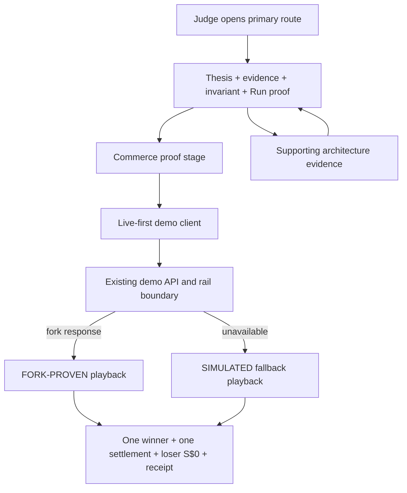
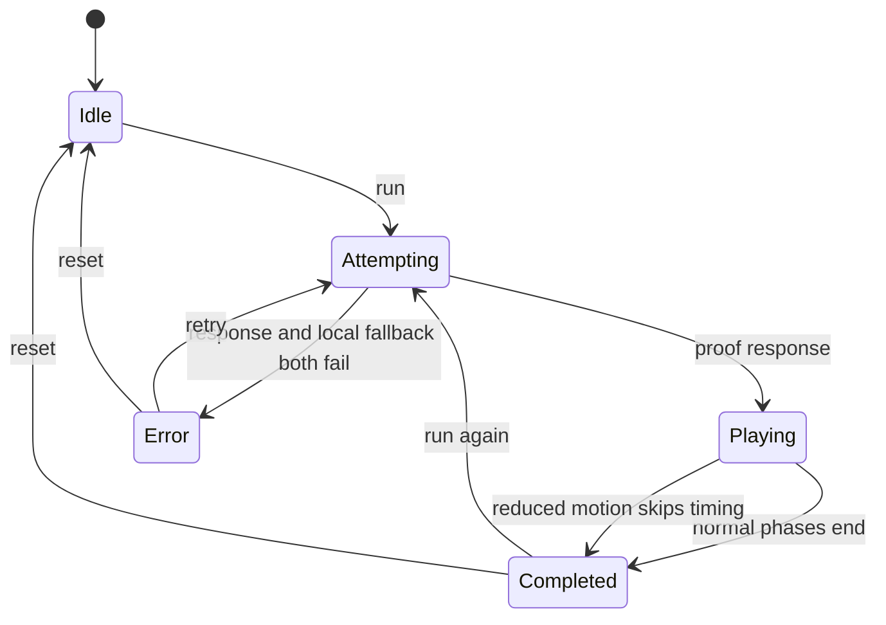
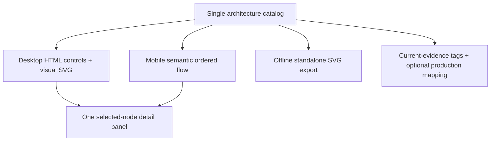

# Judge-First UI and Proof Flow - Plan

## Goal Capsule

- **Objective:** Turn Morrow's existing proof into a polished judge-first product experience that communicates the merchant problem, the one-winner/zero-charge-loser invariant, and the exact proof boundary within sixty seconds on desktop and mobile.
- **Authority order:** The current user request; this plan; `PRODUCT.md`; `docs/decisions/mainnet-mvp.md`; current code and tests; `README.md`. The older `docs/ideation/morrow-build-goal-prompt.md` is not authoritative where it conflicts with the mainnet decision record.
- **Execution profile:** Preserve the current black, ivory, acid-lime, editorial merchant-operations identity. Use `pnpm` only. Do not use Claude Code. Avoid new heavy UI or state-management dependencies.
- **Repository posture:** Fetch before work and fast-forward when the working tree is clean and upstream is ahead. Preserve local or teammate changes and stop if an overlapping dirty change makes a safe pull impossible.
- **Proof boundary:** Keep payment semantics unchanged. The demo response may replace raw failure text with a stable safe code/message, but presentation work must never imply a real mainnet transaction, funded Permit2 approval, or deployed AWS infrastructure.
- **Stop conditions:** Stop for a product-scope contradiction, a payment claim that cannot be supported, or an upstream/local conflict that cannot be preserved safely. Use engineering judgment for reversible presentation details.
- **Landing posture:** Complete local implementation and verification first. Push, connect Vercel to GitHub, or make another production deployment only with explicit approval at that point.

---

## Product Contract

### Summary

Morrow will use `/` as the canonical judge experience and `/architecture` as supporting evidence. The first viewport will show the thesis, the proof boundary, the decisive invariant, and an immediately usable proof action. Desktop and mobile will each present one coherent proof rather than the mobile page becoming a vertical stack of desktop panels.

### Problem Frame

The current visual language is distinctive, but the information architecture works against the hackathon context. The hero delays the decisive action, the mobile proof separates cause from outcome across a long scroll, operational text is often too small, and proof-mode labels can conflate a mainnet protocol target with fork or simulation evidence.

The architecture route has the same problem in a different form. Its fixed-width SVG requires horizontal scrolling on phones, duplicates selection across multiple control sets, and uses one `LIVE` label for both deployed routes and fork-only payment work. The default automated test suite also depends on a local Anvil process, so a normal `pnpm test` fails in a clean environment.

### Actors

- A1. **Hackathon judge:** Needs the product thesis, outcome, sponsor technology, and truth boundary in under sixty seconds.
- A2. **Demo operator:** Needs predictable run, retry, reset, fallback, and reduced-motion behavior without exposing internal errors.
- A3. **Teammate or maintainer:** Needs truthful architecture evidence and deterministic default verification.

### Requirements

**Judge-first information architecture**

- R1. `/` is the primary submission and judge route; `/architecture` is a supporting deep dive with an obvious return to the proof.
- R2. The first viewport at each target size includes the product thesis, proof evidence label, decisive invariant, and enabled `Run proof` action without scrolling.
- R3. The idle experience explains one merchant SKU, two agents, one winner, one settlement, and a loser charged S$0 before animation begins.
- R4. Dining remains the visual demonstration wedge while copy makes the merchant primitive applicable to appointments, tickets, rentals, and limited inventory.
- R20. The first-minute flow states the Track 3 merchant value: scarce inventory is hard to sell safely to autonomous buyers; the merchant publishes commitment terms; agents become first-class customers through a machine-readable purchase and settlement path.
- R21. The primary route identifies x402 as the machine-payment protocol, XSGD as the settlement asset, and Avalanche C-Chain as the target network without presenting a fork or deterministic run as a mainnet broadcast.

**Proof experience and truth**

- R5. The proof uses explicit `idle`, `attempting`, `playing`, `completed`, and exceptional `error` states, with proof mode and phase represented independently.
- R6. A live-fork response plays the current six-step proof and is labelled as a local Avalanche mainnet fork, never as a mainnet broadcast.
- R7. An unavailable live path falls back automatically to the deterministic proof and shows concise judge-facing copy without raw hosts, ports, stack traces, or internal exception text.
- R8. Run controls are single-flight. Reset is available only after completion or error; navigation/unmount aborts the browser wait and invalidates stale responses, but the UI never claims that a client abort cancels server work or an already-submitted chain transaction.
- R9. Reduced-motion users receive the same data and outcome without waiting through the timed phase animation.
- R10. Inventory, both agents, the winner, the loser balance of S$0, proof mode, and receipt outcome remain visually connected on every target viewport.

**Architecture evidence**

- R11. Architecture nodes expose one or more current-evidence labels from `DEPLOYED`, `FORK-PROVEN`, `SIMULATED`, and `NOT USED`; an optional production mapping such as AWS is rendered as a separate dimension and never as current evidence.
- R12. The architecture experience is semantic HTML first on mobile, requires no horizontal page scroll, and exposes one primary selection path per breakpoint.
- R13. The architecture SVG remains available on desktop and as an offline export, but it is not the only accessible representation of the system.
- R14. Architecture utilities such as theme switching and download are secondary to the system flow and expose toggle/download feedback accessibly.

**Accessibility, quality, and operations**

- R15. Every interactive element has a visible keyboard focus state, accurate accessible name/state, and at least a 44px touch target where it appears in page chrome.
- R16. Operational copy is legible at judge distance, contrast meets WCAG AA, one concise live region announces proof progress, and the page remains usable with JavaScript animation reduced.
- R17. No target viewport has accidental horizontal page overflow, clipped actions, overlapping text, or hidden proof outcomes.
- R18. Default tests are deterministic and do not require Anvil; fork integration tests run only through a separate documented command.
- R19. Typecheck, lint, deterministic tests, production build, and browser QA pass before the work is considered complete.

### Key Flows

- F1. **Judge proof:** A judge opens `/`, understands the merchant problem and invariant, runs the proof, sees the current mode, watches the causal sequence, and reaches one settlement, one winner, a S$0 loser, and an exercised receipt. With reduced motion enabled, the same outcome appears immediately after data arrives.
- F2. **Fallback proof:** A live attempt is unavailable, the UI activates the deterministic proof automatically, discloses that no payment was broadcast, and completes the same product invariant.
- F3. **Interrupted proof:** While work is active, repeated activation cannot start another run. Navigation or unmount invalidates the client wait so a stale result cannot update visible state; reset and retry become available only from completed or error states.
- F4. **Architecture evidence:** A judge moves from the proof to `/architecture`, scans what is deployed, fork-proven, simulated, planned, and rejected, then returns to the proof.
- F5. **Developer verification:** A maintainer runs the default quality gate without Anvil and invokes the separate fork gate only after starting the documented local fork.

### Acceptance Examples

- AE1. **First viewport:** Given a 390x844 viewport, when a judge opens `/`, then the merchant SKU, two named agents, one-winner/one-settlement/S$0-loser outcome, thesis, evidence label, and `Run proof` action are all visible without scrolling. Covers R1-R3 and R20-R21.
- AE2. **Deterministic fallback:** Given the local fork is unreachable, when the judge runs the proof, then the UI labels a deterministic proof, states that no payment was broadcast, hides the raw endpoint, and still completes one winner plus a S$0 loser. Covers R5-R8.
- AE3. **Reduced motion:** Given reduced motion is enabled, when proof data arrives, then the final causal outcome becomes available without the normal multi-second timed sequence. Covers R9.
- AE4. **Mobile coherence:** Given a 360x800 viewport, when the proof completes, then inventory, both contenders, winner, S$0 loser, mode, and receipt outcome can be understood as one composition. Covers R10 and R17.
- AE5. **Architecture truth:** Given a mobile visitor opens `/architecture`, when they scan the system, then they do not need horizontal scrolling and can distinguish deployed code from fork evidence, deterministic simulation, AWS plans, and rejected rails. Covers R11-R14.
- AE6. **Clean test tier:** Given Anvil is not running, when the default verification runs, then deterministic tests pass and no healthy-fork assertion executes. Covers R18-R19.
- AE7. **Track and sponsor fit:** Given a judge scans the first-minute flow, when they explain the product back, then they can identify the merchant-controlled scarce-inventory problem, agent-as-customer model, x402 protocol role, XSGD settlement role, and Avalanche target network without inferring a mainnet broadcast. Covers R20-R21.

### Success Criteria

- A new judge can explain the merchant problem, x402/XSGD/Avalanche role, winner/loser outcome, and proof limitation after a single sixty-second walkthrough.
- Every design-quality axis from the UI review rubric scores at least 4/5: first impression, hierarchy, composition, brand, interaction, assets, implementation, accessibility, performance, and product readiness.
- Browser QA passes at 1440x1000, 1024x768, 390x844, and 360x800 in both default and reduced-motion modes.
- The public experience contains no false mainnet/AWS claim and no raw localhost or internal failure string.

### Scope Boundaries

**In scope**

- The two public page routes, their client components, shared presentation data, CSS, tests, and judge-facing documentation.
- Proof state modelling, client-side stale-result invalidation, fallback presentation, reduced-motion behavior, architecture taxonomy, responsive composition, and accessibility.

**Out of scope**

- Changing x402, Permit2, XSGD, settlement, inventory-lock, or receipt semantics.
- Real mainnet funding or settlement, wallet onboarding, accounts, generic agent chat, production AWS infrastructure, or a new component library.
- Replacing the restaurant wedge with a multi-vertical marketplace demo.

#### Deferred to Follow-Up Work

- Connect the Vercel project to GitHub so future `main` commits deploy automatically. The project currently has no Git integration even though the local checkout is linked to the Vercel project.
- Run and document a funded mainnet transaction only after its separate safety and compatibility prerequisites are satisfied.

---

## Planning Contract

### Key Technical Decisions

- KTD1. **Keep one canonical judge route.** `/` owns product persuasion and proof; `/architecture` owns technical evidence. This removes two competing entry points while preserving the existing route boundary. Governs R1-R4.
- KTD2. **Preserve the current design system.** Extend the existing tokens, editorial display type, mono operational labels, square borders, and acid-lime actions instead of adding a UI library or generic card system. Governs R2, R10, R15-R17.
- KTD3. **Use an explicit presentation state model.** Model request lifecycle separately from proof mode and proof phase so reset, stale results, fallback, retry, single-flight protection, and reduced motion have deterministic behavior. Governs R5-R10.
- KTD4. **Keep payment logic below the presentation boundary.** UI components consume the existing proof response through pure presentation derivations and do not reimplement rail decisions. Governs R5-R10 and R18.
- KTD5. **Use HTML as the accessible architecture control surface.** The SVG is a desktop visualization and export artifact; real HTML controls own focus, selection, status, and mobile reading order. Governs R11-R16.
- KTD6. **Separate evidence dimensions rather than calling everything live.** Current evidence is a multi-valued tag set (`DEPLOYED`, `FORK-PROVEN`, `SIMULATED`, `NOT USED`); production mapping is optional metadata rendered separately. Governs R6-R7 and R11-R14.
- KTD7. **Separate deterministic and fork test configurations.** Default Vitest excludes fork-only files; a dedicated fork configuration owns healthy-Anvil assertions. Governs R18-R19.

### High-Level Technical Design

The diagrams describe the required relationships and state transitions. Exact component and helper names may change if implementation finds a simpler fit.

### Assumptions

- The public Vercel function cannot reach a developer's `127.0.0.1` fork, so the production experience normally demonstrates the deterministic path unless a separate reachable fork service is configured.
- A small presentation/view-model module may be introduced if it makes the state transitions and copy testable without coupling tests to React internals.
- Theme and SVG download remain useful, but neither is a first-screen judge action.

### Risks and Mitigations

- **Visual polish obscures truth:** Keep proof status next to the claim and outcome; validate copy against `docs/decisions/mainnet-mvp.md` before browser QA.
- **Mobile compactness hides causality:** Preserve inventory, both contenders, current step, and outcome in one composition; move only hashes and secondary protocol facts below it.
- **Animation introduces races:** Retain the run-id stale-result guard, disable repeat activation while active, abort only the browser wait on unmount, clear scheduled playback work, and test repeated action paths. Do not represent browser abort as cancellation of server or chain work.
- **Reduced motion is cosmetic only:** Branch the JavaScript playback timing, not just CSS transition duration.
- **Architecture data drifts between SVG and list:** Derive both from one ordered catalog and test complete node/status coverage.
- **Fork tests leak into the default gate:** Use a separate filename pattern and configuration, then prove `pnpm test` with Anvil stopped.

### System-Wide Impact

- Payment semantics stay stable. `runDemo` may accept an abort signal for browser lifecycle cleanup, while the API/rail boundary maps internal failures to a stable safe public code/message and retains detailed diagnostics server-side only.
- Architecture status types change every consumer in `lib/architecture.ts`, `components/architecture-stage.tsx`, and their tests.
- Route hierarchy changes require `README.md` and `TEAMMATE_HANDOFF.md` to identify `/` as the submission URL.
- Production deployment remains manually triggered until the separate Vercel Git integration decision is authorized.

---

## Implementation Units

### U1. Reconcile route hierarchy and presentation contracts

- **Goal:** Establish one source of truth for route priority, proof presentation state, sanitized mode copy, and architecture evidence taxonomy.
- **Requirements:** R1, R4-R7, R11, R18, R20-R21; F1, F2, F4; AE7.
- **Dependencies:** None.
- **Files:** `PRODUCT.md`, `README.md`, `TEAMMATE_HANDOFF.md`, `lib/commerce.ts`, `lib/architecture.ts`, `lib/run-demo.ts`, `lib/rail/run-proof.ts`, `app/api/demo/route.ts`, `tests/commerce.test.ts`, `tests/demo-client.test.ts`, `tests/architecture.test.ts`.
- **Approach:**
  1. Make `/` the documented primary route and keep `/architecture` as evidence.
  2. Add pure presentation contracts for lifecycle, strict proof-response validation, stable fallback copy, current-evidence tags, and optional production mapping.
  3. Map caught rail/API failures to a stable safe public code/message before serialization. Raw hostnames, ports, credentials, RPC payloads, and stack text remain server-only diagnostics.
  4. Keep XSGD, x402, contender, receipt, and rail semantics unchanged.
- **Patterns to follow:** Existing constant catalogs and pure helper tests in `lib/commerce.ts` and `lib/architecture.ts`.
- **Test scenarios:**
  - Every architecture node has an explicit evidence status; unknown nodes cannot default to a positive live claim.
  - Fork evidence, deterministic simulation, production mapping, deployed routes, and rejected rails render distinct labels.
  - A fallback response produces judge-safe copy that contains no localhost address or port.
  - Null, empty, partial, duplicate-contender, wrong-winner-count, nonzero-loser, incomplete-receipt, and proof-mode-mismatch payloads are rejected by runtime validation.
  - The public API JSON contains no raw hostname, port, RPC error, credential, or stack detail when the rail fails.
  - Existing 0.20 XSGD, winner, loser, receipt, and phase invariants remain unchanged.
- **Verification:** Data contracts compile, current rail tests retain their meaning, and route documentation no longer names architecture as the submission landing page.

### U2. Move the judge decision into the first viewport

- **Goal:** Recompose `/` so the claim, evidence boundary, invariant, and action are visible immediately while preserving the current brand.
- **Requirements:** R1-R4, R15-R17, R20-R21; F1; AE1 and AE7.
- **Dependencies:** U1.
- **Files:** `app/page.tsx`, `components/commerce-stage.tsx`, `app/globals.css`, `tests/commerce.test.ts`.
- **Approach:**
  1. Reduce or merge the oversized hero with the proof entry rather than placing a full landing panel before the product.
  2. Place protocol target and execution evidence in separate, nearby labels.
  3. Make the idle stage explain the whole invariant and keep `Run proof` visible at each target size.
  4. Hide reset until completion or error and disable repeat activation while work is active.
- **Patterns to follow:** Current hero type scale, rule lines, acid-lime action treatment, and system-font constraint in `app/globals.css`.
- **Test scenarios:**
  - Pure presentation data for idle shows inventory, both agents, one settlement, and loser S$0 before proof data exists.
  - Protocol-target copy never represents fork or deterministic evidence as a mainnet broadcast.
- **Verification:** At 1440x1000, 1024x768, 390x844, and 360x800, the first viewport passes AE1 and retains the established brand rather than a generic SaaS layout.

### U3. Make proof playback deterministic, interruptible, and accessible

- **Goal:** Implement the explicit proof state model, single-flight live attempt, stale-client invalidation, fallback, reduced motion, retry, reset, and concise announcements.
- **Requirements:** R5-R10, R15-R16; F1-F3; AE2-AE4.
- **Dependencies:** U1 and U2.
- **Files:** `components/commerce-stage.tsx`, `lib/run-demo.ts`, `lib/commerce.ts`, `app/globals.css`, `tests/demo-client.test.ts`, `tests/commerce.test.ts`.
- **Approach:**
  1. Centralize lifecycle transitions so invalid combinations of `running`, `proof`, and phase cannot render.
  2. Pass an abort signal through the demo client for unmount/navigation cleanup while retaining the existing stale-run guard; explicitly do not claim that this cancels server or chain work.
  3. Clear client playback work on reset and unmount. Do not expose reset while a request or playback is active.
  4. Skip timed playback for reduced-motion users after data is available.
  5. Use one concise live region and keep technical failure detail outside the judge path.
- **Execution note:** Add state-transition and client-failure coverage before replacing the current implicit state combinations.
- **Patterns to follow:** Existing deterministic fallback validation in `lib/run-demo.ts` and run-id invalidation in `CommerceStage`.
- **Test scenarios:**
  - A valid fork response enters playback with fork-proven evidence and completes the existing phases.
  - Fetch rejection, non-OK response, and invalid payload each enter deterministic playback with sanitized disclosure.
  - Unmount during request aborts the client wait and prevents the response from updating stale UI without claiming to cancel the server operation.
  - Reset after completion or error returns the stage to idle and clears proof data.
  - Rapid repeat activation cannot start concurrent runs.
  - Reduced motion moves from received proof to completed outcome without normal timed waits.
  - If both remote proof and local deterministic generation fail, the error state offers retry and reset without exposing internal details.
- **Verification:** Every state and transition has one observable action hierarchy, no timers survive reset/unmount, and console QA reports no errors.

### U4. Build an intentional responsive proof composition

- **Goal:** Present the complete causal proof as one designed stage on desktop and mobile, with readable copy and robust keyboard/touch behavior.
- **Requirements:** R10 and R15-R17; F1-F3; AE4.
- **Dependencies:** U2 and U3.
- **Files:** `components/commerce-stage.tsx`, `app/globals.css`, `app/page.tsx`.
- **Approach:**
  1. Keep the desktop inventory/race/receipt relationship simultaneous.
  2. Create a compact mobile composition with inventory summary, two contender rows, current phase, settlement result, and receipt outcome visible as one narrative.
  3. Move long hashes and secondary protocol facts into a lower detail region rather than shrinking critical text.
  4. Raise operational text sizes, add shared focus-visible styles, retain 44px targets, and prevent page overflow.
- **Patterns to follow:** Existing CSS custom properties, responsive breakpoints, squared panels, ledger language, and reduced-motion media query.
- **Test scenarios:** Test expectation: none -- this unit changes presentation and is verified through the browser matrix and existing pure presentation tests.
- **Verification:** Screenshots at all target sizes show a coherent proof; keyboard-only use reaches every action in logical order; zoom and narrow widths do not clip the outcome.

### U5. Rebuild architecture as responsive supporting evidence

- **Goal:** Make `/architecture` truthful, readable, keyboard accessible, and useful on mobile without competing with the main proof.
- **Requirements:** R1, R11-R17; F4; AE5.
- **Dependencies:** U1.
- **Files:** `app/architecture/page.tsx`, `components/architecture-stage.tsx`, `lib/architecture.ts`, `app/globals.css`, `tests/architecture.test.ts`, `docs/architecture/README.md`.
- **Approach:**
  1. Lead with a compact truth rail and a clear return to `Run proof`.
  2. Derive a complete ordered HTML flow and desktop SVG from the same catalog.
  3. Use the HTML list or stepper as the primary mobile and accessible interaction; make the SVG presentational for assistive technology.
  4. Remove duplicate selection paths and include all relevant nodes consistently.
  5. Demote theme/export utilities, add `aria-pressed`, and announce export success or failure.
- **Patterns to follow:** Existing node catalog, selection detail panel, offline SVG helpers, and architecture export tests.
- **Test scenarios:**
  - The ordered semantic flow covers every node intended for judge inspection, including approval and rejected approaches where relevant.
  - Each node displays current evidence separately from any AWS production mapping.
  - The standalone SVG still has baked colors and no external network dependency.
  - Theme controls expose selected state and export produces explicit success/failure feedback.
- **Verification:** Mobile has no required horizontal scroll, desktop retains a useful system diagram, and keyboard/screen-reader users can inspect the same evidence through HTML controls.

### U6. Isolate fork verification and run the full quality gate

- **Goal:** Make normal development verification reliable while retaining the full fork proof as an explicit integration tier.
- **Requirements:** R18-R19; F5; AE6.
- **Dependencies:** U1-U5.
- **Files:** `package.json`, `vitest.config.ts`, `vitest.fork.config.ts`, `tests/rail.test.ts`, `tests/rail.fork.test.ts`, `README.md`, `rail/fork/README.md`.
- **Approach:**
  1. Keep pure rail invariants and dead-port fallback in the default suite.
  2. Move healthy-fork signing, verification, settlement, loser-balance, replay, deadline, and approval assertions into a fork-only file and configuration.
  3. Document the fork prerequisite and make the separate command the only default path that requires Anvil.
  4. Run the deterministic gate, the fork gate for any deployment-eligible build, and the complete browser state/viewport matrix.
- **Execution note:** First prove the default suite passes with Anvil stopped; then start the fork and prove the integration tier independently.
- **Patterns to follow:** Current Vitest tests and `rail/fork` rehearsal scripts.
- **Test scenarios:**
  - Default suite passes when port 8545 is closed.
  - Default dead-port test returns deterministic proof and never throws.
  - Fork suite fails fast with a clear prerequisite when invoked without Anvil.
  - Healthy fork verifies both authorizations without transfer, settles only the winner, preserves loser balance, rejects replay, and rejects invalid timing.
- **Verification:** The Verification Contract passes and the browser matrix covers idle, attempting, fallback, every visible phase, completed, retry, reset, keyboard-only, and reduced-motion behavior.

---

## Verification Contract

| Gate | Applicability | Proves | Required outcome |
|---|---|---|---|
| `pnpm test` | Always | Deterministic domain, route, client, architecture, and fallback behavior | Passes with Anvil stopped |
| `pnpm typecheck` | Always | Type safety across new lifecycle and evidence contracts | Zero errors |
| `pnpm lint` | Always | Static quality and React/Next.js conventions | Zero errors |
| `pnpm build` | Always | Production compilation and both public routes | Includes `/` and `/architecture` |
| `pnpm test:fork` | Required before declaring a build deployment-eligible | Permit2 fork verification, single settlement, loser unchanged, replay and timing guards | Start the documented fork and pass all scenarios; an unavailable fork blocks deployment eligibility |
| Browser QA | Always | Judge flow, responsive layout, interaction states, accessibility, and console health | All target sizes and state paths pass |

Browser QA must cover 1440x1000, 1024x768, 390x844, and 360x800. For each relevant size, inspect idle, attempting, deterministic fallback, completed, rerun, reset, keyboard-only use, reduced motion, and horizontal overflow. Capture screenshots of the first viewport, active proof, completed outcome, mobile architecture flow, and desktop architecture diagram.

---

## Definition of Done

- Every R-ID and acceptance example is satisfied or explicitly reported as blocked with evidence.
- `/` presents the claim, evidence label, invariant, and proof action in the first viewport at every target size.
- The completed proof keeps inventory, both agents, one winner, one settlement, loser S$0, and receipt outcome visually connected on desktop and mobile.
- Live fork, deterministic simulation, deployed routes, production mapping, and rejected rails are never conflated.
- No judge-facing UI exposes raw localhost URLs, internal errors, false mainnet settlement claims, or false AWS deployment claims.
- Proof reset, retry, single-flight protection, client-side stale-response invalidation, and reduced-motion paths behave deterministically; no UI copy claims client-side cancellation of server or chain work.
- `/architecture` works without horizontal page scrolling on mobile and exposes equivalent semantic evidence without relying on SVG controls.
- All automated gates pass; fork-only checks are isolated and must pass before the build is considered deployment-eligible.
- Browser QA passes with no console errors, inaccessible controls, clipped actions, or accidental overflow.
- Documentation identifies `/` as the primary judge route and accurately explains the test tiers and proof boundary.
- Dead-end experiments, unused styles, superseded copy, and abandoned abstractions are removed from the final diff.
- The final handoff reports exact verification evidence, any fork-tier limitation, the current commit, and whether work is local-only, pushed, or deployed.
